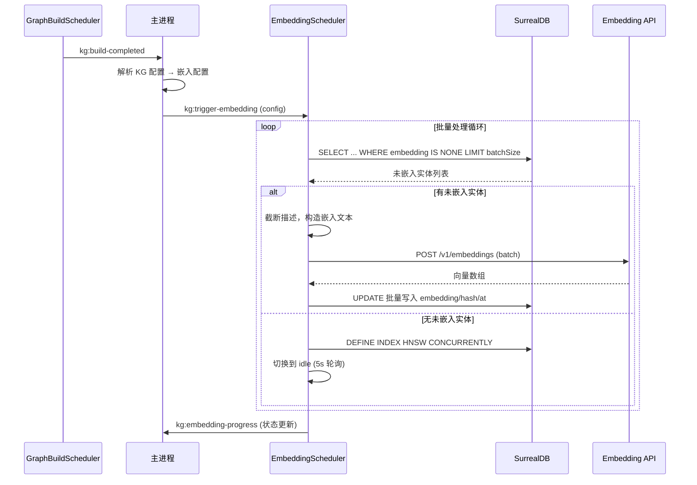
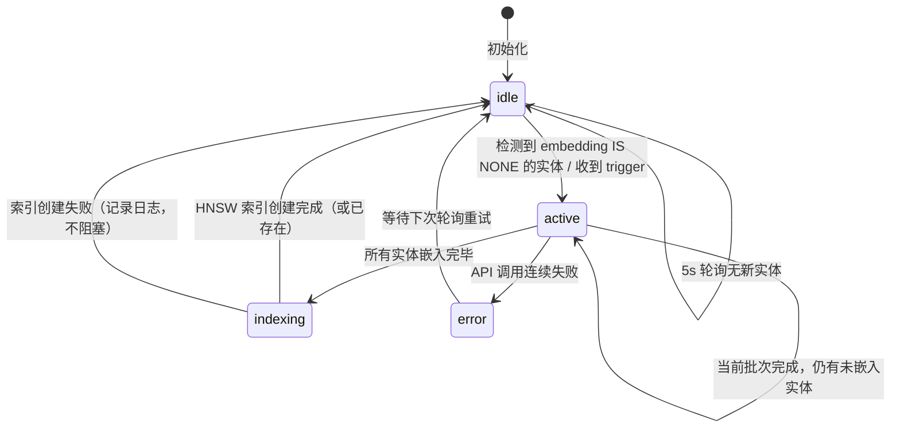

# 设计文档：知识图谱实体向量索引层

## 概述

在现有知识图谱构建流水线（文档 → TaskScheduler(LLM抽取) → kg_llm_result_cache → GraphBuildScheduler(解析+UPSERT) → 图谱表）之后，新增 EmbeddingScheduler 阶段。该调度器作为常驻单例运行在 Knowledge-graph 子进程中，采用纯内存任务队列（不建中间表），通过状态机驱动：idle（5s 低频轮询）→ active（高频批量嵌入）→ HNSW 索引创建 → idle。

核心数据流：
```
GraphBuildScheduler 完成
  → 主进程收到 kg:build-completed
  → 主进程解析嵌入配置，发送 kg:trigger-embedding
  → EmbeddingScheduler 扫描 embedding IS NONE 的实体
  → 批量调用 /v1/embeddings API
  → 写回 embedding/embedding_hash/embedding_at
  → 所有实体处理完毕 → DEFINE INDEX HNSW CONCURRENTLY
  → 回到 idle
```

设计原则：
- 纯内存驱动，不建中间表，中断即丢弃当前批次
- 批量原子写入，不产生部分写入的脏数据
- 通过 `embedding IS NONE` 扫描实现无状态恢复，兼容存量数据
- 嵌入配置由主进程解析后传入子进程，子进程不持有知识库配置

## 架构



### 状态机



## 组件与接口

### 1. EmbeddingScheduler（新建）

文件：`src/utility/Knowledge-graph/core/embedding-scheduler.ts`

```typescript
interface EmbeddingConfig {
  baseUrl: string
  apiKey: string
  model: string
  dimensions: number
  batchSize: number
  maxTokens: number
}

interface TargetInfo {
  namespace: string
  database: string
  graphTableBase: string
}

type SchedulerState = 'idle' | 'active' | 'error'

interface BatchResult {
  successCount: number
  failCount: number
  durationMs: number
  remaining: number
}

interface EmbeddingStatus {
  state: SchedulerState
  completed: number
  pending: number
  total: number
  hnswIndexReady: boolean
  lastError: string | null
  lastBatchInfo: BatchResult | null
}

class EmbeddingScheduler {
  // 依赖
  private client: KGSurrealClient
  private sendMessage: (msg: KGToMainMessage) => void
  
  // 状态
  private state: SchedulerState = 'idle'
  private pollTimer: ReturnType<typeof setInterval> | null = null
  private isProcessing: boolean = false
  
  // 配置（由 trigger 消息设置）
  private embeddingConfig: EmbeddingConfig | null = null
  private targetInfo: TargetInfo | null = null
  
  // HNSW 索引缓存
  private hnswCreatedSet: Set<string> = new Set()
  
  // 调试信息
  private lastError: string | null = null
  private lastBatchInfo: BatchResult | null = null
  
  // 常量
  private readonly IDLE_POLL_INTERVAL = 5000   // idle 态 5s 轮询
  private readonly ACTIVE_POLL_INTERVAL = 100   // active 态快速循环
  
  constructor(client, sendMessage)
  
  // 启动/停止
  start(): void              // 启动 idle 轮询
  stop(): void               // 停止轮询
  
  // 外部触发
  trigger(config: EmbeddingConfig, target: TargetInfo): void
  
  // 状态查询
  getStatus(): EmbeddingStatus
  
  // 内部方法
  private async poll(): Promise<void>
  private async scanPendingEntities(): Promise<EntityRow[]>
  private async processBatch(entities: EntityRow[]): Promise<BatchResult>
  private buildEmbeddingText(name: string, description: string): string
  private async callEmbeddingAPI(texts: string[]): Promise<number[][]>
  private async writeBatchToDb(entities: EntityRow[], vectors: number[][]): Promise<void>
  private async ensureHnswIndex(): Promise<void>
  private setState(newState: SchedulerState, reason: string): void
}
```

### 2. Graph Schema 扩展（修改）

文件：`src/utility/Knowledge-graph/service/graph-schema/index.ts`

在 entity 表定义中新增三个字段：

```sql
DEFINE FIELD IF NOT EXISTS embedding      ON {entity} TYPE option<array<float>>;
DEFINE FIELD IF NOT EXISTS embedding_hash  ON {entity} TYPE string DEFAULT '';
DEFINE FIELD IF NOT EXISTS embedding_at    ON {entity} TYPE option<datetime>;
```

使用 `DEFINE FIELD IF NOT EXISTS` 确保幂等性，兼容已有数据。

### 3. Graph Upsert 修改（修改）

文件：`src/utility/Knowledge-graph/core/graph-upsert.ts`

在 entity UPSERT 的描述追加分支中，清空嵌入状态：

```sql
UPSERT {entity}:⟨{name}⟩ SET
  ...
  description = IF description IS NONE OR description = ''
    THEN {desc}
    ELSE string::concat(description, '\n---\n', {desc})
  END,
  -- 描述变更时清空嵌入状态
  embedding = NONE,
  embedding_hash = '',
  ...
```

### 4. IPC 消息协议扩展（修改）

文件：`src/Public/ShareTypes/knowledge-graph-ipc.types.ts`

新增消息类型：

```typescript
// Main → KG
| { type: 'kg:trigger-embedding'; data: KGTriggerEmbeddingParams }
| { type: 'kg:query-embedding-status'; requestId: string }

// KG → Main
| { type: 'kg:embedding-progress'; data: KGEmbeddingProgressData }
| { type: 'kg:embedding-status'; requestId: string; data: KGEmbeddingStatusData }

// 参数类型
interface KGTriggerEmbeddingParams {
  targetNamespace: string
  targetDatabase: string
  graphTableBase: string
  baseUrl: string
  apiKey: string
  model: string
  dimensions: number
  batchSize: number
  maxTokens: number
}

interface KGEmbeddingProgressData {
  state: 'idle' | 'active' | 'error'
  completed: number
  pending: number
  total: number
  hnswIndexReady: boolean
  lastError: string | null
  lastBatchInfo: {
    successCount: number
    failCount: number
    durationMs: number
    remaining: number
  } | null
}

type KGEmbeddingStatusData = KGEmbeddingProgressData
```

### 5. MessageHandler 扩展（修改）

文件：`src/utility/Knowledge-graph/bridge/message-handler.ts`

新增两个消息路由：
- `kg:trigger-embedding` → `embeddingScheduler.trigger(config, target)`
- `kg:query-embedding-status` → `embeddingScheduler.getStatus()` → 发送 `kg:embedding-status` 响应

MessageHandler 构造函数新增 `embeddingScheduler` 参数。

### 6. Entry 集成（修改）

文件：`src/utility/Knowledge-graph/entry.ts`

```typescript
import { EmbeddingScheduler } from './core/embedding-scheduler'

const embeddingScheduler = new EmbeddingScheduler(surrealClient, sendMessage)

// 传入 MessageHandler
const messageHandler = new MessageHandler(
  surrealClient, taskSubmission, scheduler,
  graphBuildScheduler, graphQueryService, embeddingScheduler, sendMessage
)

// 启动
embeddingScheduler.start()
```

### 7. KnowledgeGraphBridge 扩展（修改）

文件：`src/main/services/knowledge-graph-bridge/index.ts`

- 在 `handleMessage` 中处理 `kg:embedding-progress` 和 `kg:embedding-status`
- 新增 `triggerEmbedding(params)` 方法
- 新增 `queryEmbeddingStatus()` 方法
- 在 `onBuildCompleted` 回调中，由主进程解析嵌入配置并调用 `triggerEmbedding`

### 8. KnowledgeGraphModelConfig 扩展（修改）

文件：`src/preload/types/knowledge-config.types.ts`

```typescript
interface KnowledgeGraphModelConfig {
  // ... 现有字段
  embeddingBatchSize?: number   // 默认 20
  embeddingMaxTokens?: number   // 默认 1500
}
```

### 9. 前端监控 UI（修改）

文件：`src/renderer/src/views/MainWindow/MainContent/views/TaskMonitorView/KgMonitorCard/index.vue`

在现有 KgMonitorCard 顶部新增嵌入状态监控区域：
- 状态指示灯（idle=绿色、active=蓝色闪烁、error=红色）
- 进度条（已完成/总数）
- HNSW 索引状态标签
- 最近批次摘要（成功/失败/耗时）
- 最近错误信息（可折叠）

通过 0.5s 间隔轮询 `kg:query-embedding-status` 获取数据。

## 数据模型

### Entity 表扩展字段

| 字段 | 类型 | 默认值 | 说明 |
|------|------|--------|------|
| embedding | `option<array<float>>` | NONE | 实体向量，维度由嵌入模型决定 |
| embedding_hash | `string` | `''` | 描述内容的 SHA-256 哈希（前 16 位），用于变更检测 |
| embedding_at | `option<datetime>` | NONE | 最近一次嵌入时间 |

### HNSW 索引定义

```sql
DEFINE INDEX IF NOT EXISTS idx_{entity}_embedding
  ON {entity}
  FIELDS embedding
  HNSW DIMENSION {dimensions}
  DIST COSINE
  CONCURRENTLY;
```

### 嵌入文本构造规则

1. 取实体 description，按 `\n---\n` 分隔为段落数组
2. 从头依次累加段落，当总字符数超过 `maxTokens * 4` 时停止（不加入超限段落）
3. 最终文本格式：`{entity_name}: {truncated_segments_joined}`

### 批量写入 SQL

```sql
UPDATE {entity}:⟨{name}⟩ SET
  embedding = $vec,
  embedding_hash = $hash,
  embedding_at = time::now();
```

每批次所有实体的 UPDATE 语句拼接后一次性执行（原子性）。

</text>
</invoke>

## 正确性属性

*正确性属性是系统在所有合法执行中都应保持为真的特征或行为——本质上是关于系统应该做什么的形式化陈述。属性是人类可读规范与机器可验证正确性保证之间的桥梁。*

### Property 1: Upsert 后嵌入状态正确性

*对于任意*实体名和描述，执行 upsertGraphData 后：
- 若实体是新建的（首次插入），则 embedding 应为 NONE，embedding_hash 应为空字符串
- 若实体已存在且描述被追加，则 embedding 应被清空为 NONE，embedding_hash 应被清空为空字符串

**验证: 需求 2.1, 2.2**

### Property 2: 嵌入文本构造正确性

*对于任意*实体名（非空字符串）和描述（任意字符串，可包含 `\n---\n` 分隔符），以及任意正整数 maxTokens，`buildEmbeddingText(name, description, maxTokens)` 的输出应满足：
1. 以 `{entity_name}: ` 开头
2. 去掉前缀后的文本长度不超过 `maxTokens * 4` 个字符
3. 输出文本中的每个段落都是原始描述中按 `\n---\n` 分割后的某个完整段落（不截断段落内部）

**验证: 需求 4.1, 4.2, 4.3**

### Property 3: 扫描恢复正确性

*对于任意*一组实体记录（部分 embedding 为 NONE，部分有值），扫描 `WHERE embedding IS NONE` 返回的结果集应恰好等于 embedding 为 NONE 的实体集合，不多不少。

**验证: 需求 3A.2, 11.1, 11.3**

### Property 4: 批量写入原子性

*对于任意*一批实体和对应的向量数组，若向量数组长度与实体数量不匹配（模拟部分失败），则 writeBatchToDb 不应执行任何写入；若匹配，则所有实体的 embedding 都应被更新。

**验证: 需求 3A.3**

### Property 5: 嵌入写入 Round-Trip

*对于任意*实体和合法的浮点数向量（长度等于 dimensions），写入 embedding 字段后再查询，返回的向量应与写入的向量在浮点精度范围内相等。

**验证: 需求 5.3**

### Property 6: HNSW 索引创建幂等性

*对于任意*表名，多次调用 ensureHnswIndex 应该只在第一次执行 DEFINE INDEX 语句（通过内存 Set 缓存），后续调用应直接跳过。

**验证: 需求 6.2**

### Property 7: 状态机转换合法性

*对于任意*事件序列（trigger、batchComplete、allDone、error），EmbeddingScheduler 的状态转换应遵循定义的状态机规则：
- idle 只能转换到 active
- active 只能转换到 active（继续处理）或 indexing（全部完成）或 error
- indexing 只能转换到 idle
- error 只能转换到 idle

**验证: 需求 3.2**

## 错误处理

### 嵌入 API 错误

| 错误场景 | 处理策略 |
|----------|----------|
| API 返回 HTTP 4xx/5xx | 记录错误日志（含状态码、错误消息、失败实体列表），跳过当前批次，继续下一批次 |
| API 超时（30s） | 通过 AbortController 中止请求，记录超时日志，跳过当前批次 |
| API 返回向量维度不匹配 | 记录错误日志，丢弃整批结果，继续下一批次 |
| 网络连接失败 | 记录错误日志，EmbeddingScheduler 切换到 error 状态，等待下次 idle 轮询重试 |

### 数据库错误

| 错误场景 | 处理策略 |
|----------|----------|
| 批量写入失败 | 记录错误日志，该批次数据丢弃（下次轮询会重新扫描到这些实体） |
| 扫描查询失败 | 记录错误日志，保持当前状态，等待下次轮询 |
| HNSW 索引创建失败 | 记录错误日志，不阻塞调度器回到 idle（下次处理完毕时会重试） |
| 跨库查询切换失败 | 记录错误日志，尝试恢复到原库上下文 |

### 进程中断恢复

| 场景 | 恢复策略 |
|------|----------|
| 批次处理中进程中断 | 内存数据丢失，未写入 DB 的批次自动丢弃。重启后通过 `embedding IS NONE` 扫描自动恢复 |
| HNSW 索引创建中进程中断 | `DEFINE INDEX IF NOT EXISTS` 语义保证幂等性，重启后重新创建 |
| 配置丢失（未收到 trigger） | idle 轮询不执行嵌入操作（无配置），等待主进程重新发送 `kg:trigger-embedding` |

## 测试策略

### 属性测试（Property-Based Testing）

使用 `fast-check` 库进行属性测试，每个属性至少运行 100 次迭代。

重点测试的纯函数：
- `buildEmbeddingText`: 文本截断逻辑（Property 2）
- 状态机转换逻辑（Property 7）

需要 mock 的集成测试：
- `upsertGraphData` 扩展后的嵌入状态清空（Property 1）
- 扫描恢复正确性（Property 3，需要 mock DB）
- 批量写入原子性（Property 4，需要 mock DB）
- 嵌入写入 round-trip（Property 5，需要 mock DB）
- HNSW 索引幂等性（Property 6）

### 单元测试

- `buildEmbeddingText` 边界情况：空描述、无分隔符、单段超长、maxTokens=0
- `callEmbeddingAPI` 错误处理：超时、4xx、5xx、空响应、维度不匹配
- `setState` 日志输出验证
- `getStatus` 返回值结构验证

### 集成测试

- 端到端流程：GraphBuildScheduler 完成 → 主进程触发 → EmbeddingScheduler 处理 → 向量写入 → HNSW 索引创建
- IPC 消息路由：`kg:trigger-embedding`、`kg:query-embedding-status` 的完整链路
- 进程重启恢复：模拟中断后重启，验证未嵌入实体被重新处理

### 属性测试标签格式

每个属性测试用注释标注：
```typescript
// Feature: kg-entity-embedding, Property 2: 嵌入文本构造正确性
```
