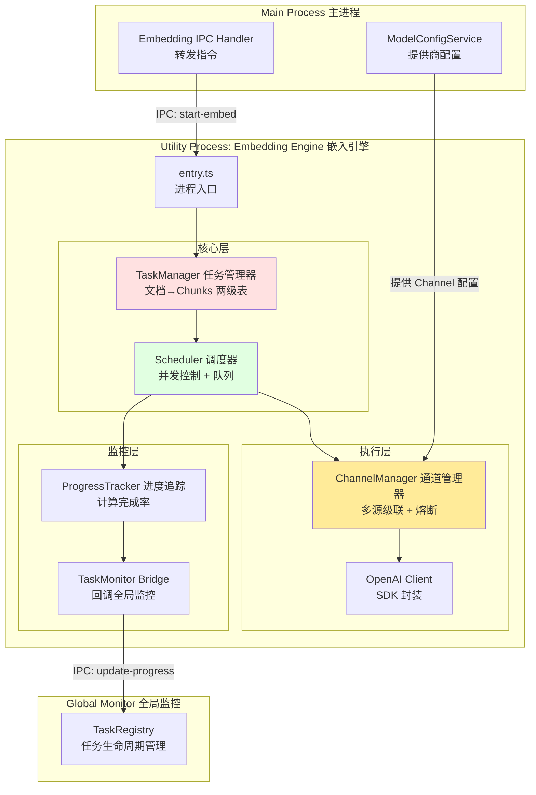
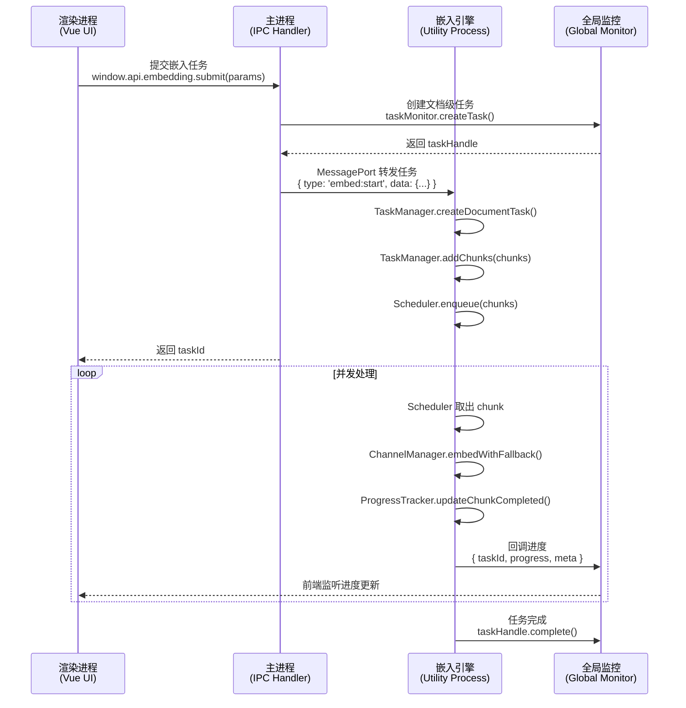

# 嵌入系统完整设计方案 (Embedding Engine Design)

> **创建时间**: 2026-01-26  
> **版本**: v1.0  
> **目标**: 基于项目现状,设计高性能、高可用、成本优化的向量嵌入系统

---

## 📊 一、系统定位与核心需求

### 1.1 系统特性
- **网络 I/O 密集型**: 主要瓶颈在 HTTP 请求,而非 CPU 计算
- **独立进程运行**: Utility Process,绝不阻塞主进程和 UI
- **高吞吐设计**: 通过并发控制压榨网络带宽,达到服务商 RPM 上限

### 1.2 核心职责

#### ✅ 已明确的职责
1. **维护分层任务表**: 文档 → Chunks 的两级结构
2. **按序提交 Chunks**: 调用 OpenAI SDK 进行非流式嵌入
3. **进度计算与回调**: `已完成 Chunks / 总 Chunks` → 通知全局监控
4. **多源轮询与切换**: 同一模型的多个 Channel,按优先级级联

#### 🎯 需要设计的部分
- 任务表的具体数据结构
- Chunk 提交的调度算法
- 与 TaskRegistry 的集成方式
- Channel 配置与切换逻辑
- 错误处理与重试策略

---

## 🏗️ 二、整体架构设计

### 2.1 系统分层



### 2.2 模块职责划分

| 模块 | 文件 | 职责 | 核心方法 |
|------|------|------|----------|
| **TaskManager** | `task-manager.ts` | 维护文档和 Chunks 的两级映射关系 | `createDocumentTask()`, `addChunks()`, `getNextChunk()` |
| **Scheduler** | `scheduler.ts` | 并发控制 + 队列调度 | `setConcurrency()`, `submitChunk()`, `_processQueue()` |
| **ChannelManager** | `channel-manager.ts` | 多源轮询 + 自动降级 | `embedWithFallback()`, `markChannelFailed()` |
| **OpenAIClient** | `openai-client.ts` | OpenAI SDK 封装 | `createEmbedding()` |
| **ProgressTracker** | `progress-tracker.ts` | 进度计算 | `updateChunkCompleted()`, `getDocumentProgress()` |

---

## 🗂️ 三、核心数据结构设计

### 3.1 两级任务表 (TaskManager)

```typescript
/**
 * 文档级任务 (Document Task)
 */
interface DocumentTask {
  documentId: string           // 文档唯一标识 (例如: fileKey 或 hash)
  totalChunks: number          // 总 chunk 数
  completedChunks: number      // 已完成数
  failedChunks: number         // 失败数
  status: 'pending' | 'running' | 'completed' | 'failed'
  createdAt: number
  updatedAt: number
  
  // 可选元数据
  meta?: {
    fileName?: string
    knowledgeBaseId?: string
  }
}

/**
 * Chunk 级任务
 */
interface ChunkTask {
  chunkId: string              // chunk 唯一标识 (documentId + index)
  documentId: string           // 所属文档
  index: number                // 在文档中的序号 (用于排序)
  text: string                 // 待嵌入的文本
  status: 'pending' | 'running' | 'completed' | 'failed' | 'retrying'
  retryCount: number           // 重试次数
  embedding?: number[]         // 生成的向量 (完成后填充)
  error?: string               // 错误信息
  createdAt: number
  updatedAt: number
}
```

**存储方式**:
```typescript
class TaskManager {
  private documentTasks: Map<string, DocumentTask> = new Map()
  private chunkTasks: Map<string, ChunkTask> = new Map()
  
  // 索引: 快速查询某文档的所有 chunks
  private documentChunksIndex: Map<string, Set<string>> = new Map()
}
```

### 3.2 通道配置 (Channel Config)

```typescript
/**
 * 单个通道配置
 * 注意: 一个模型可以有多个通道
 */
interface ChannelConfig {
  id: string                   // channel-xxx
  providerId: string           // 对应 ModelConfigService 的 providerId
  priority: number             // 优先级 (0最高, 数字越大优先级越低)
  baseUrl: string              // API 基地址
  apiKey: string               // API 密钥
  model: string                // 模型名称 (e.g. text-embedding-3-large)
  
  // 状态管理
  status: 'active' | 'degraded' | 'blacklisted'
  failureCount: number         // 连续失败次数
  lastFailedAt?: number        // 最后失败时间
  blacklistedUntil?: number    // 黑名单解除时间
  
  // 性能参数
  maxRetries: number           // 单次请求最大重试次数 (针对单个 channel)
  timeout: number              // 请求超时时间 (ms)
}
```

**配置来源**:
- 从 `ModelConfigService` 读取 `providers`
- 用户可为同一模型配置多个 provider,每个 provider 对应一个 channel
- 嵌入引擎内部按 `priority` 排序

### 3.3 任务提交参数 (Submit Params)

```typescript
/**
 * 前端提交嵌入任务的参数
 */
interface SubmitEmbeddingTaskParams {
  documentId: string           // 文档 ID
  chunks: Array<{
    index: number              // chunk 在文档中的顺序
    text: string               // chunk 文本
  }>
  
  // 嵌入配置
  embeddingConfig: {
    modelId: string            // 模型 ID (e.g. text-embedding-3-large)
    dimensions?: number        // 可选: 向量维度
  }
  
  // 可选元数据
  meta?: {
    fileName?: string
    knowledgeBaseId?: string
  }
}
```

---

## ⚙️ 四、核心流程设计

### 4.1 任务提交流程



### 4.2 Chunk 调度算法 (Scheduler)

#### 核心设计思路
- **并发池 (Concurrency Pool)**: 用信号量 (Semaphore) 控制同时运行的任务数
- **FIFO 队列**: 按 documentId + index 顺序提交 (保证同一文档内 chunks 按序处理)
- **动态调节**: 允许运行时修改 `maxConcurrency`

#### 伪代码
```typescript
class Scheduler {
  private queue: ChunkTask[] = []
  private running: Set<string> = new Set()
  private maxConcurrency: number = 3 // 默认并发数
  
  async enqueue(chunks: ChunkTask[]): Promise<void> {
    this.queue.push(...chunks)
    this._tryProcess()
  }
  
  setConcurrency(value: number): void {
    this.maxConcurrency = value
    this._tryProcess() // 立即生效
  }
  
  private async _tryProcess(): Promise<void> {
    while (this.running.size < this.maxConcurrency && this.queue.length > 0) {
      const chunk = this.queue.shift()!
      this.running.add(chunk.chunkId)
      
      // 异步处理 chunk
      this._processChunk(chunk).finally(() => {
        this.running.delete(chunk.chunkId)
        this._tryProcess() // 递归调用,处理下一个
      })
    }
  }
  
  private async _processChunk(chunk: ChunkTask): Promise<void> {
    try {
      const embedding = await this.channelManager.embedWithFallback(chunk.text)
      this.taskManager.markChunkCompleted(chunk.chunkId, embedding)
      this.progressTracker.updateChunkCompleted(chunk.documentId)
    } catch (err) {
      this.taskManager.markChunkFailed(chunk.chunkId, err.message)
    }
  }
}
```

### 4.3 多通道级联 (Channel Cascading)

#### 级联策略
1. **按优先级排序**: `priority: 0, 1, 2, ...`
2. **逐级尝试**: 从 priority=0 开始,失败后尝试下一级
3. **熔断机制**: 连续失败 N 次的 channel 进入黑名单 (cooldown 5分钟)

#### 伪代码
```typescript
class ChannelManager {
  private channels: ChannelConfig[] = []
  
  async embedWithFallback(text: string): Promise<number[]> {
    // 排序: priority 升序, 过滤黑名单
    const activeChannels = this.channels
      .filter(ch => ch.status !== 'blacklisted' || Date.now() > ch.blacklistedUntil!)
      .sort((a, b) => a.priority - b.priority)
    
    let lastError: Error | null = null
    
    for (const channel of activeChannels) {
      try {
        const embedding = await this.openaiClient.createEmbedding({
          baseUrl: channel.baseUrl,
          apiKey: channel.apiKey,
          model: channel.model,
          input: text
        })
        
        // 成功: 重置失败计数
        channel.failureCount = 0
        channel.status = 'active'
        return embedding
        
      } catch (err) {
        lastError = err
        this.markChannelFailed(channel.id, err.code)
        
        // 特定错误不重试下一个 (如: 400 Bad Request)
        if (err.code === 400) {
          throw err
        }
        
        // 继续尝试下一个 channel
        continue
      }
    }
    
    // 所有 channel 都失败
    throw lastError || new Error('No active channels available')
  }
  
  private markChannelFailed(channelId: string, errorCode?: number): void {
    const channel = this.channels.find(ch => ch.id === channelId)
    if (!channel) return
    
    channel.failureCount++
    channel.lastFailedAt = Date.now()
    
    // 熔断: 连续失败 5 次 → 黑名单 5 分钟
    if (channel.failureCount >= 5) {
      channel.status = 'blacklisted'
      channel.blacklistedUntil = Date.now() + 5 * 60 * 1000
      
      // 5 分钟后自动解除黑名单
      setTimeout(() => {
        channel.status = 'active'
        channel.failureCount = 0
      }, 5 * 60 * 1000)
    }
  }
}
```

### 4.4 进度计算与回调

#### 计算公式
```
文档进度 = (completedChunks / totalChunks) * 100
```

#### 回调时机
- 每完成一个 chunk,立即回调 (`updateChunkCompleted()`)
- 回调内容包括:
  - `taskId`: 全局监控的任务 ID
  - `progress`: 当前进度百分比
  - `meta`: 额外信息 (如: `completedChunks`, `totalChunks`, `currentRPM`)

#### 伪代码
```typescript
class ProgressTracker {
  async updateChunkCompleted(documentId: string): Promise<void> {
    const docTask = this.taskManager.getDocumentTask(documentId)
    if (!docTask) return
    
    docTask.completedChunks++
    docTask.updatedAt = Date.now()
    
    const progress = (docTask.completedChunks / docTask.totalChunks) * 100
    
    // 回调全局监控
    await this.taskMonitorBridge.updateProgress(docTask.taskId, progress, {
      completedChunks: docTask.completedChunks,
      totalChunks: docTask.totalChunks,
      documentId: documentId
    })
    
    // 检查是否完成
    if (docTask.completedChunks === docTask.totalChunks) {
      await this.taskMonitorBridge.complete(docTask.taskId)
    }
  }
}
```

---

## 📡 五、IPC 通信协议设计

### 5.1 消息类型定义

```typescript
/**
 * Main Process → Embedding Engine
 */
type EmbeddingEngineInboundMessage =
  | { type: 'embed:start'; data: SubmitEmbeddingTaskParams }
  | { type: 'embed:pause'; data: { documentId: string } }
  | { type: 'embed:resume'; data: { documentId: string } }
  | { type: 'embed:cancel'; data: { documentId: string } }
  | { type: 'config:update-channels'; data: { channels: ChannelConfig[] } }
  | { type: 'config:set-concurrency'; data: { concurrency: number } }

/**
 * Embedding Engine → Main Process
 */
type EmbeddingEngineOutboundMessage =
  | { type: 'task:progress'; data: { documentId: string; progress: number; meta: any } }
  | { type: 'task:completed'; data: { documentId: string; embeddings: Map<number, number[]> } }
  | { type: 'task:failed'; data: { documentId: string; error: string } }
  | { type: 'channel:failed'; data: { channelId: string; error: string } }
  | { type: 'metrics:rpm-update'; data: { currentRPM: number } }
```

### 5.2 IPC Handler (主进程端)

```typescript
// src/main/ipc/embedding-handler.ts
export class EmbeddingIPCHandler {
  constructor(
    private embeddingEnginePort: MessagePort,
    private taskMonitorService: TaskMonitorService
  ) {
    this.setupListeners()
  }
  
  async submitEmbeddingTask(params: SubmitEmbeddingTaskParams): Promise<string> {
    // 1. 创建全局监控任务
    const taskHandle = await this.taskMonitorService.createTask({
      type: 'embedding',
      title: `嵌入: ${params.meta?.fileName || params.documentId}`,
      meta: {
        documentId: params.documentId,
        totalChunks: params.chunks.length
      }
    })
    
    // 2. 转发给 Embedding Engine
    this.embeddingEnginePort.postMessage({
      type: 'embed:start',
      data: {
        ...params,
        taskId: taskHandle.taskId // 关联全局监控 ID
      }
    })
    
    return taskHandle.taskId
  }
  
  private setupListeners(): void {
    this.embeddingEnginePort.on('message', (msg: EmbeddingEngineOutboundMessage) => {
      switch (msg.type) {
        case 'task:progress':
          // 转发进度给全局监控
          // (Embedding Engine 内部已经通过 TaskMonitorBridge 回调)
          break
          
        case 'task:completed':
          // 可以在这里持久化嵌入结果到 SurrealDB/VectorDB
          this.saveEmbeddings(msg.data.documentId, msg.data.embeddings)
          break
          
        case 'channel:failed':
          // 记录日志或告警
          console.warn(`Channel ${msg.data.channelId} failed:`, msg.data.error)
          break
      }
    })
  }
}
```

---

## 🛠️ 六、错误处理与重试策略

### 6.1 错误分类

| 错误类型 | HTTP 状态码 | 处理策略 |
|---------|------------|---------|
| **客户端错误** | 400, 401, 403 | 不重试,立即失败 |
| **速率限制** | 429 | 切换下一个 channel |
| **服务端错误** | 500, 502, 503 | 切换下一个 channel |
| **超时** | Timeout | 切换下一个 channel |
| **网络错误** | ECONNRESET, ETIMEDOUT | 切换下一个 channel |

### 6.2 重试逻辑

- **单 Channel 重试**: 不进行,直接切换下一个 channel (避免浪费时间)
- **级联重试**: 遍历所有 channels,全部失败后才标记任务失败
- **任务级重试**: 用户可手动重试失败的文档

---

## 🎛️ 七、用户配置与监控

### 7.1 配置面板设计 (UI)

**位置**: `UserSettingView.vue` → `EmbeddingConfigView.vue`

**配置项**:
1. **并发数设置** (滑块 1-50)
   - 默认值: 3
   - 说明: 同时进行的 HTTP 请求数
   
2. **Channel 配置** (列表)
   - 显示所有 providers
   - 允许设置每个 provider 的优先级 (拖拽排序)
   - 显示 Channel 状态 (active / degraded / blacklisted)

3. **熔断参数** (高级)
   - 连续失败次数阈值 (默认 5)
   - 黑名单时长 (默认 5 分钟)

### 7.2 监控视图 (Monitoring)

**位置**: `TaskMonitorView.vue` → `EmbeddingMetricsPanel.vue`

**实时指标**:
- 当前 RPM (Requests Per Minute)
- 并发数 / 队列长度
- Channel 健康状态 (饼图)
- 文档处理进度 (列表)

---

## 📦 八、文件结构

```
src/utility/embedding-engine/
├── entry.ts                      # 进程入口
├── README.md                     # 架构文档 (本文件)
│
├── core/                         # 核心模块
│   ├── task-manager.ts          # 任务管理器 (文档→Chunks 两级表)
│   ├── scheduler.ts             # 调度器 (并发控制 + 队列)
│   └── progress-tracker.ts      # 进度追踪
│
├── channel/                      # 通道管理
│   ├── channel-manager.ts       # 多源级联 + 熔断
│   └── openai-client.ts         # OpenAI SDK 封装
│
├── bridge/                       # 通信桥接
│   └── task-monitor-bridge.ts  # 与全局监控的 IPC 桥接
│
└── types.ts                      # 内部类型定义
```

---

## 🚀 九、实施路线图

### Phase 1: 基础架构 (1-2天)
- [x] 目录结构创建
- [x] `entry.ts` 与 IPC 握手
- [ ] `task-manager.ts` (两级表)
- [ ] `scheduler.ts` (基础队列)

### Phase 2: 核心功能 (2-3天)
- [ ] `channel-manager.ts` (单 channel)
- [ ] `openai-client.ts` (SDK 封装)
- [ ] `progress-tracker.ts`
- [ ] 集成 TaskRegistry

### Phase 3: 高级特性 (2-3天)
- [ ] 多 channel 级联
- [ ] 熔断机制
- [ ] 并发动态调节
- [ ] IPC Handler (主进程)

### Phase 4: UI 与测试 (2天)
- [ ] `EmbeddingConfigView.vue` (配置面板)
- [ ] `EmbeddingMetricsPanel.vue` (监控面板)
- [ ] 端到端测试

---

## 🔍 十、关键技术决策

### 10.1 为什么不用 Worker Pool?
- **Worker Pool** 适合 CPU 密集型任务 (如图像处理)
- **嵌入任务** 是网络 I/O 密集型,单线程 + async/await 即可压榨带宽
- Utility Process 本身已经隔离,不需要额外线程池

### 10.2 为什么不批量提交 Chunks?
- OpenAI SDK 支持 `input: string[]`,但存在问题:
  - 某些 channel 的批量 API 不稳定
  - 批量失败后无法精确定位失败的 chunk
- **决策**: 逐个提交,保证精细控制

### 10.3 如何存储嵌入结果?
- **方案 1**: 实时写入 SurrealDB (每完成一个 chunk 就写)
- **方案 2**: 内存累积,文档完成后批量写入
- **推荐**: 方案 2 + 失败重试机制

---

## 📚 十一、参考资料

- [OpenAI Embeddings API](https://platform.openai.com/docs/guides/embeddings)
- [Electron Utility Process](https://www.electronjs.org/docs/latest/api/utility-process)
- [项目 Wiki - Document Processing Pipeline](#8)
- [项目 Wiki - Task Monitoring System](#7)

---

**设计完成,等待审核与实施! 🎉**
