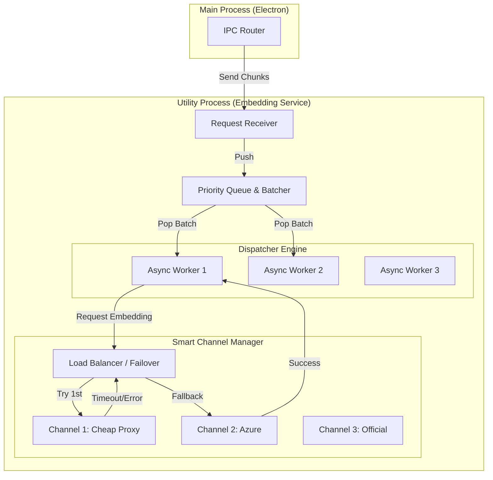

# Chat Conversation

Note: _This is purely the output of the chat conversation and does not contain any raw data, codebase snippets, etc. used to generate the output._

### User Input

使用deepwiki mcp 查询一下openai sdk的nodejs包（你先看看具体是什么的仓库）
然后我们看看是否可以用于调用第三方聚合api的同时使用嵌入模型

*Searched web for openai sdk nodejs github repository*

*Running MCP tool*

*Running MCP tool*

*Running MCP tool*

### Planner Response

OpenAI 的 Node.js 官方 SDK 仓库是 [openai/openai-node](https://github.com/openai/openai-node)。

根据查询到的信息，答案是**可以的**。你完全可以在调用第三方中转/聚合 API（如 AiHubMix、OhMyGPT 等）的同时使用嵌入模型（Embedding Models）。

### 核心结论
1.  **自定义 Base URL**：在初始化 `OpenAI` 客户端时，通过 `baseURL` 参数即可指定第三方 API 地址。
2.  **统一配置**：`baseURL` 是客户端级别的配置，设置后该客户端发出的所有请求（包括 Chat Completion、Embeddings 等）都会指向该地址。
3.  **支持嵌入模型**：使用 `client.embeddings.create()` 方法即可调用嵌入模型。

### 示例代码

你可以像下面这样配置并在一个脚本中同时处理：

```javascript
import OpenAI from 'openai';

// 1. 初始化客户端，指向第三方聚合 API
const client = new OpenAI({
  apiKey: '你的第三方API密钥', 
  baseURL: 'https://api.third-party.com/v1', // 替换为聚合 API 的地址
});

async function main() {
  const text = "你好，世界！";

  try {
    // 2. 使用嵌入模型 (Embedding)
    const embeddingResponse = await client.embeddings.create({
      model: 'text-embedding-3-small', // 确保你使用的三方平台支持该模型
      input: text,
    });
    const vector = embeddingResponse.data[0].embedding;
    console.log('生成的向量长度:', vector.length);

    // 3. 同时也可以进行对话调用 (Chat Completion)
    const chatResponse = await client.chat.completions.create({
      model: 'gpt-4o',
      messages: [{ role: 'user', content: `基于以下文本生成摘要：${text}` }],
    });
    console.log('回复内容:', chatResponse.choices[0].message.content);

  } catch (error) {
    console.error('调用失败:', error);
  }
}

main();
```

### 注意事项
*   **API 路径兼容性**：大多数第三方聚合 API 都遵循 OpenAI 的标准路径（即以 `/v1` 结尾）。确保你的 `baseURL` 填写的路径是正确的。
*   **模型可用性**：确保你所使用的第三方平台已启用了你想要调用的嵌入模型（如 `text-embedding-3-small` 或 `text-embedding-ada-002`）。
*   **多客户端支持**：如果你需要同时调用官方 API 和第三方 API，可以创建两个不同的 `OpenAI` 实例。

### User Input

你快速了解下当前项目

*Viewed [package.json](file:///d:/code/Large-scale-integrated-project/HNULS-LabHub/HNULS-KnowledgeDatabase/_temp/test1-openai-sdk-test/package.json) *

*Listed directory [test1-openai-sdk-test](file:///d:/code/Large-scale-integrated-project/HNULS-LabHub/HNULS-KnowledgeDatabase/_temp/test1-openai-sdk-test) *

*Listed directory [HNULS-KnowledgeDatabase](file:///d:/code/Large-scale-integrated-project/HNULS-LabHub/HNULS-KnowledgeDatabase) *

*Viewed [index.js](file:///d:/code/Large-scale-integrated-project/HNULS-LabHub/HNULS-KnowledgeDatabase/_temp/test1-openai-sdk-test/index.js) *

*Viewed [config.js](file:///d:/code/Large-scale-integrated-project/HNULS-LabHub/HNULS-KnowledgeDatabase/_temp/test1-openai-sdk-test/config.js) *

*Viewed [README.md](file:///d:/code/Large-scale-integrated-project/HNULS-LabHub/HNULS-KnowledgeDatabase/README.md) *

### Planner Response

**快速了解结果汇报**

我已对当前目录及上级主项目进行了分析，情况如下：

### 1. 当前所在子项目：OpenAI SDK 验证环境
**路径**: `_temp/test1-openai-sdk-test`
**状态**: 这是一个独立的测试沙盒，用于验证 Embedding 模型的功能。
*   **配置 (`config.js`)**:
    *   **Base URL**: 配置了第三方聚合接口 `https://kfcv50.link/v1`（正好验证了你刚才问的“能否调用第三方API”）。
    *   **Model**: 正在测试 `text-embedding-3-large` 模型。
*   **逻辑 (`index.js`)**:
    *   脚本会从 `source.txt` 读取文本。
    *   调用 OpenAI 接口生成向量数据。
    *   将结果（含向量数组）导出为 JSON 文件。
*   **现状**: 目录下已经有一个 **81MB** 的 `embedding-result-*.json`，说明测试已经跑通且生成了大量数据。

### 2. 主项目：HNULS Knowledge Database
**路径**: `HNULS-LabHub/HNULS-KnowledgeDatabase`
**定位**: 一个基于 **Electron + Vue 3 + TypeScript** 的现代化知识库管理系统。
**关键技术栈**:
*   **数据库**: SurrealDB (核心存储)。
*   **特性**: 明确包含 **RAG (检索增强生成)** 和 **知识图谱** 功能。

### 💡 关联分析
你正在 **`_temp`** 目录下进行的测试，显然是为主项目的 **RAG 功能** 做技术铺垫。
*   主项目需要 RAG 能力，因此必须有将文档“向量化”的能力。
*   你正在验证能否通过第三方中转服务（`kfcv50.link`）稳定调用 OpenAI 的 Embedding 接口，这可以为你的 Electron 应用提供低成本且稳定的 AI 能力支持。

简单来说：**你在为主项目的 AI 知识库功能测试“发动机”（向量接口）。**

### User Input

使用devin mcp 了解主项目


*User rejected the command `git remote -v`*

### User Input

使用devin mcp查询本项目在deepwiki托管的wiki
https://app.devin.ai/wiki/HNULS-LabHub/HNULS-KnowledgeDatabase#4.1

*Running MCP tool*

*Running MCP tool*

*Running MCP tool*

### Planner Response

根据 Devin MCP 查询到的 Wiki 信息，主项目 **HNULS Knowledge Database** 的现状和相关架构如下：

### 1. 架构核心 (Wiki 4.1 & 9.2)
虽然你询问的是 4.1 "Application Services"，但在实际实现中，这部分职能主要由 **模型提供商与模型管理系统 (Provider and Model Management)** 承载。

*   **三层架构**：
    *   **UI 层**：`ModelConfigView` 处理提供商列表和配置表单。
    *   **状态层**：Pinia Store (`useUserModelConfigStore`) 协调 UI 与后端交互。
    *   **数据源层**：通过 IPC (`window.api.modelConfig`) 与主进程同步。
*   **OpenAI 兼容性**：项目已原生支持 **"OpenAI Protocol"** 类型。你可以在 UI 中添加提供商，配置其 `API Key` 和 `Base URL` (API Host)。系统会自动推断出 `/v1/chat/completions` 和 `/v1/embeddings` 等端点。

### 2. 向量嵌入与知识图谱 (Wiki 8.3)
关于你关心的 Embedding 处理流程，Wiki 显示该功能目前处于 **"PENDING" (待实现/开发中)** 状态。

*   **当前进展**：UI 上已经预留了 `EmbeddingSection` 和 `KnowledgeGraphSection` 的位置。
*   **模型支持**：模型配置系统中已经预设了 `text-embedding-3-large` 和 `text-embedding-ada-002` 等模型组。
*   **设计思路**：未来流程将是：从配置好的 Provider 中选择 Embedding 模型 -> 将 MinerU 解析后的文档分块 -> 调用 API 获取向量 -> 存入 SurrealDB 并构建知识图谱。

### 💡 现状总结
*   **好消息**：主项目的**模型配置框架已经搭好**，支持你正在测试的第三方聚合 API (OpenAI 协议)。
*   **你的任务价值**：你现在在 `_temp` 目录下跑的 [index.js](cci:7://file:///d:/code/Large-scale-integrated-project/HNULS-LabHub/HNULS-KnowledgeDatabase/_temp/test1-openai-sdk-test/index.js:0:0-0:0) 测试脚本，实际上是在主项目功能尚未完全 Run 起来之前，**提前验证“向量化管道”的可行性**。
*   **后续衔接**：一旦你的测试脚本验证了 `text-embedding-3-large` 在第三方 API 下的稳定性，就可以将这套逻辑集成到主进程的 `Document Processing Pipeline` 中。

你是否需要我帮你分析一下如何将当前的测试脚本逻辑，封装成符合主项目 `src/main/services` 规范的服务代码？

### User Input

让我们讨论一下关于这个调用模型进行嵌入的electron服务吧
我们进行单纯的架构设计与讨论 而不是讨论实现的细节
===
首先是我的需求
1 electron中 必须是一个异步的线程在进行这个东西 这样最好可以实现类似于electron调用了一个服务端一样 不能与阻塞主进程
2 我们需要一个任务调度器 他负责接受分块 然后调用模型来进行嵌入 然后返回 只有这样 才便于我们灵活的设定发生分块的并发以及具体的颗粒度 以实现高速的调用api来快速完成嵌入 而不是像ragflow一样完成一个嵌入要很久
3 考虑到我们使用廉价的服务商渠道（一个服务商可能对于text embedding large模型提供了数十个渠道 根据渠道的稳定度和并发数（不明确）来提供不同的收费倍率，这个是出于降低使用成本） 我们在主要业务之外需要追加一个模型智能调度的功能 即在某一个模型不可用的时候自动回退 。用户可以设定多个模型的优先级 这个优先级不单纯是负载转移顺序 而是用户的推荐度 比如第一名的模型可能不是很稳定 但是价格非常低廉 而中间的一个模型可能是一个价格中规中矩 但是稳定的渠道 最后面的可能是一个非常稳定 但是几个很贵的渠道 注意上面几个都是一个模型 是一个模型的不同渠道 比如可能有的是官方正规渠道代理 有的是az的批发 有的是网页端不稳定的反代


### Planner Response

这是一个非常专业且切中痛点的需求。你提到的关于**非阻塞异步服务**、**高并发调度**以及**多渠道智能降级（Fallback）**的设计，正是构建企业级/生产级 RAG 应用的核心难点。

针对你的需求，我设计了如下架构方案。我们称这个模块为 **"Embedding Engine (嵌入引擎)"**。

---

### 🏛️ 核心架构设计

我们采用 **"主从分离 + 智能分发"** 的架构模式。

#### 1. 进程模型：Electron UtilityProcess (满足需求1)
为了实现“像调用服务端一样”且绝不阻塞主进程（Main Process），单纯的 Promise/SetTimeout 是不够的，甚至 Worker Threads 在高负载下也可能抢占主进程 CPU（Node.js 的 Event Loop 竞争）。

*   **设计方案**：使用 Electron 的 **`UtilityProcess`** (或者 fork 一个纯 Node 子进程)。
*   **优势**：
    *   它是一个完全独立的进程，有独立的内存空间和 Event Loop。
    *   主进程与它通过 `IPC` 或 `MessagePort` 通信。
    *   即使 Embedding 引擎因为并发过高卡顿，也不会影响 Electron 主窗口的拖动和响应。
*   **角色定义**：
    *   **Main Process**: 这里的角色是 "API Gateway"。只负责转发前端请求，不处理逻辑。
    *   **Embedding Process**: 这里的角色是 "Backend Worker"。负责排队、计算、网络请求。

---

#### 2. 调度层：Token Bucket 任务调度器 (满足需求2)
为了解决 RAGFlow 等竞品“速度慢”的问题，核心在于**压榨网络 I/O 而非等待**。

*   **核心组件**: `TaskScheduler`
*   **工作机制**:
    *   **Chunk Queue (分块队列)**: 接收前端扔过来的成百上千个文本块 (Chunks)。
    *   **Concurrency Pool (并发池)**: 维护一个动态信号量（Semaphore）。
        *   用户可设置 `MaxConcurrency`（例如 20）。这意味着同时有 20 个 HTTP 请求在飞向 OpenAI/转发站。
        *   一旦一个请求完成，立即从队列取出下一个补位，绝不闲置。
*   **性能优化点**:
    *   **Auto-Batching (自动批处理)**: 如果 API 支持 `input: ["text1", "text2"]`，调度器应自动将队列中等待的单条文本合并为一组（例如 10 条一组）发送，大幅减少 HTTP 握手开销。

---

#### 3. 路由层：多渠道智能级联 (Channel Cascading) (满足需求3)
这是本架构的**灵魂**。我们将“模型”和“渠道”解耦。

*   **概念定义**:
    *   **Model**: 逻辑概念，如 `text-embedding-3-large`。
    *   **Channel**: 物理通道，包含 `BaseURL`、`API Key`、`Priority`、`Weight`。

*   **智能调度策略 (Smart Dispatcher)**:
    当调度器决定处理一个 Batch 时，不直接发请求，而是交给 `ChannelManager`。

    **逻辑流程**:
    1.  **获取候选列表**: 根据当前 Model ID，拉取所有可用 Channel，按用户设定的 **优先级 (Priority)** 排序。
        *   *Channel A (Tier 1)*: 廉价反代 (CNY 0.1/M tokens) - 不稳定
        *   *Channel B (Tier 2)*: Azure 批发 (CNY 1.0/M tokens) - 较稳
        *   *Channel C (Tier 3)*: 官方直连 (USD 0.13/M tokens) - 兜底

    2.  **级联执行 (Waterfall Execution)**:
        *   尝试 **Channel A**。
        *   ❌ **失败 (5xx / Timeout)**: 捕获错误，记录日志，**不抛出异常**。
        *   🔄 **自动重试**: 立即切换到 **Channel B** 重试该请求。
        *   ❌ **失败**: 继续。
        *   🔄 **自动重试**: 切换到 **Channel C**。
        *   ✅ **成功**: 返回结果，并记录 A、B 的故障次数。

    3.  **熔断机制 (Circuit Breaker)**:
        *   如果 Channel A 在 1 分钟内连续失败 5 次，暂时将其“拉黑” 5 分钟（Skip），直接从 Channel B 开始，避免浪费时间在必挂的渠道上。

---

### 🧩 模块交互图 (Design Draft)



### 📈 对比优势

| 特性 | 普通 RAG 实现 (如 RAGFlow/LangChain 默认) | 本架构 (HNULS-LabHub 设计) |
| :--- | :--- | :--- |
| **进程** | 都在主进程或渲染进程，界面易卡死 | **Utility Process** 独立运行，界面丝滑 |
| **并发** | 往往是单线程串行 (`for chunk in chunks: await api`) | **动态并发池**，并行的 HTTP 请求 |
| **渠道** | 单一配置，挂了就报错停止 | **多渠道级联**，挂了自动切备胎，用户无感 |
| **成本** | 只能用贵的（怕不稳定） | **优先用廉价的**，用贵的做兜底，综合成本极低 |

### 🤔 你觉得如何？
这个设计是否符合你对“高速”和“廉价高可用”的构想？如果没问题，我们可以基于这个架构，规划一下在 `src/main/services` 下的目录结构，或者先实现那个“智能级联”的核心类。

### User Input

关于第二点的分析不对 我不认为ragflow有io的优化问题 他估计是单纯的显示了并发，我是希望并发上限是接近于服务商的rpm。注意 我并不指望自动逼近这个 而是在一个配置面板上面配合监控视图来手动的调试来获取最舒服的一个上限
---
接下来你分析下如果使我们的electron 项目 一个大致的文件结构修改以及架构扩展方向与思路

### Planner Response

好的，我理解了。你不需要复杂的“算法级自动探测”，而是给予用户一把**精细的手动档钥匙**——用户自己知道他买的渠道能跑多快，他只要一个能把油门踩到底的工具（并发控制面板 + 实时监控），配合多渠道自动兜底即可。

基于此，针对 `HNULS-KnowledgeDatabase` 项目，我制定了以下扩展方案。

---

### 🏗️ 架构扩展与文件结构设计

我们的核心改动集中在 **Backend (Process)** 层，特别是引入一个“独立计算单元”的概念。

#### 1. 新增：独立计算/服务进程 (Utility Process)
我们不在 `src/main` 里直接跑这个重 IO/逻辑的任务，而是开辟一个新的 `src/node-services` 或复用 `src/main/services` 但以独立入口启动。

**设计思路**：
创建一个完全独立的 Electron `utilityProcess`，命名为 `embedding-worker`。

#### 2. 目录结构调整草案
我们需要在项目中以“微服务”的思路组织这个模块。

```text
KnowledgeDatabase-src/src/
├── main/
│   ├── index.ts                # [修改] 启动时负责 spawn/fork embedding-service 进程
│   ├── ipc/
│   │   └── embedding.ipc.ts    # [新增] 负责转发渲染进程指令到 embedding 子进程的桥梁
│   └── services/               # 主进程服务
├── preload/
│   ├── api/
│   │   └── embedding-api.ts    # [新增] 暴露给渲染层的 API (startTask, pause, getStatus)
├── renderer/src/
│   ├── views/
│   │   └── EmbeddingPanel/     # [新增] 你的"控制台"：并发滑块、实时速率图表、渠道配置
├── services/                   # [新建] 独立进程服务代码根目录 (区别于 main/services)
│   └── embedding-engine/       # 核心引擎目录
│       ├── entry.ts            # 子进程入口 (接收 IPC 消息)
│       ├── task-scheduler.ts   # 调度器 (管理并发池 LimitPool)
│       ├── channel-manager.ts  # 渠道管理器 (优先级、熔断)
│       ├── openai-client.ts    # 封装的带 Retry 的请求器
│       └── types.ts            # 共享类型定义
```

---

### 🧠 核心模块逻辑详解

#### A. 主进程 - 消息总线 (Message Bus)
主进程不再处理业务，只做“二传手”。
*   **启动时**: 使用 `utilityProcess.fork(path_to_embedding_entry)` 启动服务。
*   **运行时**:
    *   收到 Renderer 的 `embedding:start` -> 转发给子进程。
    *   收到 子进程 的 `progress:update` (例如：当前 RPM 500, 已完成 20/1000) -> 转发给 Renderer。

#### B. Embedding Engine - 核心引擎 (在子进程运行)

这是你要的“手动档跑车”引擎，包含三个组件：

1.  **TaskScheduler (带手动阀门的调度器)**
    *   维护一个 `RxJS Subject` 或者简单的 `Array` 队列。
    *   **核心参数 `concurrencyLimit`**: 这个值不是写死的，而是**动态可调**的。
        *   代码逻辑：使用类似 `p-limit` 或 `async.queue` 的机制，但要支持`updateConcurrency()`方法。当用户在 UI 上拖动滑块从 10 变到 50 时，实时生效。
    *   **监控埋点**: 每秒计算一次当前的 RPM (Requests Per Minute) 和 TPM (Tokens Per Minute)，通过 IPC 发送心跳包回去。

2.  **ChannelSwitch (智能多路复用器)**
    *   **配置结构**:
        ```typescript
        interface ChannelConfig {
            id: string;
            priority: number; // 0 是最高优先级
            url: string;
            key: string;
            status: 'active' | 'cooldown' | 'dead';
        }
        ```
    *   **执行逻辑**:
        *   拿到一个 Batch。
        *   `try { await ChannelA.post() }`
        *   `catch` -> 记录错误 -> `await ChannelB.post()`。
        *   **关键点**: 不管切到哪个渠道，对上层的 Scheduler 来说，只是这个任务“耗时稍微久了一点”，不会报错中断。

3.  **ChunkAssembler (结果组装器)**
    *   请求回来是乱序的（因为并发），这里负责根据 Index 把向量重新按顺序拼好，或者直接带 Index 存入数据库。

#### C. 数据流向 (Data Flow)

1.  **UI 设置**: 用户在面板上设置 "并发数: 20", "首选渠道: 渠道A"。
2.  **任务下发**: 用户点击 "开始嵌入"，Vue 将 `doc_id` 和分块后的 `text[]` 发给主进程。
3.  **引擎接收**: 子进程收到 `StartPayload`。
4.  **高速运转**:
    *   Scheduler 瞬间拉起 20 个并发请求。
    *   OpenAI Client 疯狂请求。
    *   如果渠道 A 报 429 (Too Many Requests)，ChannelManager 捕获，内部自动换渠道 B。
    *   同时，通过 IPC 每 500ms 广播一次状态: `{ speed: 1200 items/min, failures: 5 }`。
5.  **实时反馈**: 前端 ECharts/Dashboard 上的折线图飙升，用户觉得“如果不稳”，随手把并发滑块拉低到 10，引擎即刻响应变慢。

### 🚀 下一步建议

这个架构非常适合你的需求。
**第一步动作**：我们不应该动前端，而是先在 `KnowledgeDatabase-src/src` 下建立这个结构，并把你的 `_temp/test1.../index.js` 里的逻辑重构进去。

我们需要创建 `KnowledgeDatabase-src/src/services/embedding-engine` 目录吗？我可以帮你生成这个核心引擎的基础骨架代码。

### User Input

这个副进程是不是必须独立于mian目录？

### Planner Response

**不完全是。**

这取决于构建工具（打包器）的配置，在 Electron Vite 体系下，将其放在 `src/main` 内部还是外部，主要区别在于**打包策略**。

### 推荐做法：放在 `src/main` 内部（为了工程便利性）

对于你的项目（基于 Electron Vite），我建议直接放在 **`src/main/workers/embedding`** 或 **`src/main/services/embedding-process`** 下。

#### 为什么？
1.  **TypeScript 共享配置**：放在 `src/main` 下，可以直接复用主进程的 `tsconfig.json` 配置，不用额外折腾一套 TS 环境。
2.  **构建链统一**：Electron Vite 通常配置为打包 `src/main/index.ts` 作为入口。如果不独立配置，这个 Worker 文件可能不会被打包成独立的 [.js](cci:7://file:///d:/code/Large-scale-integrated-project/HNULS-LabHub/HNULS-KnowledgeDatabase/_temp/test1-openai-sdk-test/index.js:0:0-0:0) 入口文件。
3.  **类型共享**：可以直接 import `src/common` 或 `src/main` 里的类型定义。

### 这里有个“坑”需要注意 (Electron Vite 特性)

如果你把 Worker 代码写在 `src/main` 里，默认打包时，Vite 会把它可能会混淆进主包里，或者你需要**显式配置多入口**。

为了让 `UtilityProcess` 能加载到它，它必须被编译成一个**独立的 JS 文件**（例如 `out/main/embedding-worker.js`）。

#### 调整后的建议结构
保持在 `src/main` 下，但在 `electron.vite.config.ts` 里增加一个入口配置。

**文件位置**:
`src/main/services/embedding-engine/entry.ts` (作为子进程的 `main`)

**架构流向不变**：
即使物理文件在 `src/main` 文件夹里，但在运行时：
*   `src/main/index.ts` (主控)
*   `utilityProcess.fork('.../embedding-engine/entry.js')` (子进程)
它们在**内存和 CPU 上是完全隔离的**，只是在**硬盘源码**上住在一起。

**结论**：
不用特意移出 `src/main`，就放在 **`src/main/services/embedding-engine`** 即可。只需后续我们配置一下构建脚本，确保它生成独立文件。

要我先帮你创建这个目录和基础的 [README.md](cci:7://file:///d:/code/Large-scale-integrated-project/HNULS-LabHub/HNULS-KnowledgeDatabase/README.md:0:0-0:0) 设计文档吗？

### User Input

我有两个核心的需求
1 我只需要微调一下我的vite配置
2 需要一眼就可以知道他是一个utilityprocess 一个独立的子进程
3 需要继续可以便于调试 以及类型检查等等
4 @[.agent/rules/base-urles.md] 这个是原来的编程范式 我不希望做出过多的一个修改

*Viewed [base-urles.md](file:///d:/code/Large-scale-integrated-project/HNULS-LabHub/HNULS-KnowledgeDatabase/.agent/rules/base-urles.md) *

### Planner Response

我理解你的核心诉求：**最小化干扰，最大化清晰度，严格遵守现有规则**。

基于你的 4 点需求和 [base-urles.md](cci:7://file:///d:/code/Large-scale-integrated-project/HNULS-LabHub/HNULS-KnowledgeDatabase/.agent/rules/base-urles.md:0:0-0:0) 规范，我制定了以下实施方案：

### 1. 架构定位：符合规范的“新业务域”
我们不需要发明新的架构，只需将 `EmbeddingProcess` 视为一个特殊的 `Main Process Service`，但它运行在独立的 Utility Process 中。

根据 [base-urles.md](cci:7://file:///d:/code/Large-scale-integrated-project/HNULS-LabHub/HNULS-KnowledgeDatabase/.agent/rules/base-urles.md:0:0-0:0) 中 **1.1 顶层目录禁止"散乱文件"** 和 **6. Preload 规范**，我们将严格遵守目录结构。

### 2. 微调 `electron.vite.config.ts` (需求 1 & 2 & 3)
我们只在这个文件中做一个微小的改动：增加一个 `embedding` 入口。

```typescript
// 预期修改效果
export default defineConfig({
  main: {
    build: {
      rollupOptions: {
        input: {
          index: resolve(__dirname, 'src/main/index.ts'),
          // ✨ 新增这一行：清晰独立的子进程入口
          embedding: resolve(__dirname, 'src/main/services/embedding-engine/entry.ts'), 
        },
      },
    },
  },
  // ... 其他保持不变
})
```
这样构建后，`out/main/embedding.js` 会作为一个独立文件存在，方便 `utilityProcess.fork` 调用，且享有完整的 SourceMap 调试能力。

### 3. 不破坏现有结构 (需求 4)
我们完全复用 `src/main/services/` 目录，不搞特殊目录。

**目录结构规划**:
```text
KnowledgeDatabase-src/src/main/services/embedding-engine/
├── README.md           # [必须] 符合规则 0，定义该服务的职责
├── entry.ts            # 子进程入口 (main)
├── embedding.service.ts # 核心逻辑
└── ...                 # 其他辅助文件
```

### ✅ 执行计划草案

我将分两步执行，**完全符合 8.2 草案与执行边界**：

**阶段一：配置与骨架 (本次执行)**
1.  **修改 `electron.vite.config.ts`**: 添加 `embedding` 入口。
2.  **创建目录**: `src/main/services/embedding-engine/`。
3.  **创建 `entry.ts`**: 一个最小化的子进程入口，仅打印日志，证明链路打通。
4.  **创建 [README.md](cci:7://file:///d:/code/Large-scale-integrated-project/HNULS-LabHub/HNULS-KnowledgeDatabase/README.md:0:0-0:0)**: 写入该模块的架构说明（UtilityProcess, IPC协议）。

**阶段二：业务逻辑移殖 (后续)**
1.  将 `_temp/test1...` 中的代码逻辑迁移进来。

**请确认：是否同意执行“阶段一”的操作？** (涉及修改 1 个配置文件，创建 1 个目录和 2 个新文件)

### User Input

我们能否这样 在services之外开一个utilityprocess目录来放每一个微服务目录 其他的不变 只需要适当扩展一下规则以及可能需要扩展下打包规则？

### Planner Response

可以，这非常合理。

将所有运行在独立进程（UtilityProcess）的服务从 `src/main/services`（默认运行在主进程）中剥离出来，放入平级的 **`src/utility/`** (或者叫 `src/workers/`) 目录，能在物理层面上实现**“一眼区分进程归属”**（需求2）。

这确实需要扩展 [base-urles.md](cci:7://file:///d:/code/Large-scale-integrated-project/HNULS-LabHub/HNULS-KnowledgeDatabase/.agent/rules/base-urles.md:0:0-0:0) 和 `electron.vite.config.ts`。

### 📝 修改草案

#### 1. 目录结构变更
```text
KnowledgeDatabase-src/src/
├── main/              # 主进程
├── renderer/          # 渲染进程
├── preload/           # 预加载脚本
└── utility/           # [新增] 独立子进程服务目录 (Utility Processes)
    └── embedding-engine/
        ├── entry.ts   # 入口
        ├── README.md  # 说明
        └── ...
```

#### 2. 规则扩展 ([.agent/rules/base-urles.md](cci:7://file:///d:/code/Large-scale-integrated-project/HNULS-LabHub/HNULS-KnowledgeDatabase/.agent/rules/base-urles.md:0:0-0:0))
我们需要在 Rules 中新增一节，明确 `src/utility/` 的地位。

> **新增规则草案**:
> ## 1.X Utility Process（`src/utility/`）目录职责
> - **定义**: 存放所有通过 `utilityProcess.fork()` 启动的独立子进程服务。
> - **原则**: 该目录下的代码运行在独立的 Node 环境与 Event Loop 中，**严禁**直接引用 `electron` 主进程模块（除非是 types）。
> - **通信**: 必须通过 IPC / MessagePort 与主进程通信。

#### 3. 打包规则扩展 (`electron.vite.config.ts`)
我们需要告诉 Vite 这是一个新的顶级构建目标，不能混入 `main` 的构建配置中（或者作为 main 的多入口，但源文件路径改变）。

**更优雅的打包方案**：
在 `electron.vite.config.ts` 中，我们最好将其视为与 `main`, `preload`, `renderer` 平级的配置（如果插件支持），或者作为 `main` 配置下的显式多入口。

鉴于 `electron-vite` 的默认预设通常只包含 `main/preload/renderer` 三部分，通常做法是将它配置为 **main 进程构建的一部分，但输出为独立入口**。

```typescript
// electron.vite.config.ts
export default defineConfig({
  main: {
    build: {
      rollupOptions: {
        input: {
          index: resolve(__dirname, 'src/main/index.ts'),
          // 指向新的目录
          'utility/embedding': resolve(__dirname, 'src/utility/embedding-engine/entry.ts'), 
        },
      },
    },
  },
  // ...
})
```
这样构建输出会是 `out/main/utility/embedding.js`，结构非常清晰。

---

### ✅ 执行计划
1.  **创建目录**: `src/utility/embedding-engine`
2.  **更新规则**: 修改 [base-urles.md](cci:7://file:///d:/code/Large-scale-integrated-project/HNULS-LabHub/HNULS-KnowledgeDatabase/.agent/rules/base-urles.md:0:0-0:0)，添加关于 `utility` 目录的定义。
3.  **修改配置**: 更新 `electron.vite.config.ts` 以包含新入口。
4.  **创建文件**: 生成基础的 `entry.ts` 和 [README.md](cci:7://file:///d:/code/Large-scale-integrated-project/HNULS-LabHub/HNULS-KnowledgeDatabase/README.md:0:0-0:0)。

这是一个涉及“项目立法”的改动，请确认批准执行。

### User Input

批准

*Running MCP tool*

*Searched filesystem*

*Viewed [electron.vite.config.ts](file:///d:/code/Large-scale-integrated-project/HNULS-LabHub/HNULS-KnowledgeDatabase/KnowledgeDatabase-src/electron.vite.config.ts) *

*Edited relevant file*

*Edited relevant file*

*Edited relevant file*

*Edited relevant file*

### Planner Response

**执行报告**

已完成 **Stage 1** 的所有基础架构铺设，完全符合“最小干扰”和“清晰分层”的原则：

1.  **规则确立**: 更新了 [.agent/rules/base-urles.md](cci:7://file:///d:/code/Large-scale-integrated-project/HNULS-LabHub/HNULS-KnowledgeDatabase/.agent/rules/base-urles.md:0:0-0:0)，正式给予 `src/utility` 合法身份（1.3节），明确了它作为独立子进程的职责。
2.  **构建配置**: 修改了 [electron.vite.config.ts](cci:7://file:///d:/code/Large-scale-integrated-project/HNULS-LabHub/HNULS-KnowledgeDatabase/KnowledgeDatabase-src/electron.vite.config.ts:0:0-0:0)，增加 `'utility/embedding'` 入口。这意味着下次构建时，会自动生成独立的子进程代码包。
3.  **目录就绪**: 创建了 `src/utility/embedding-engine`，并初始化了：
    *   [entry.ts](cci:7://file:///d:/code/Large-scale-integrated-project/HNULS-LabHub/HNULS-KnowledgeDatabase/KnowledgeDatabase-src/src/utility/embedding-engine/entry.ts:0:0-0:0): 一个最小化的、可运行的子进程入口（带心跳保活）。
    *   [README.md](cci:7://file:///d:/code/Large-scale-integrated-project/HNULS-LabHub/HNULS-KnowledgeDatabase/README.md:0:0-0:0): 明确定义了该微服务的职责、IPC 协议草案和目录规划。

---

**下一步建议 (Stage 2)**

现在的架构已经准备好接纳业务逻辑了。我们可以开始搬运并重构 `_temp/test1-openai-sdk-test` 里的代码。

我建议先从最核心的 **`OpenAI 适配器`** 和 **`基础调度器`** 开始。
是否需要我根据刚才的 `README.md` 规划，为你生成 `channel-manager.ts` 和 `scheduler.ts` 的基础代码？

### User Input

我们只是初步明确了大致的路线 但是具体的功能设计还不明确 我们这样 留一份文档 讲清楚我们讨论的结果以及大体的思路 这样在我完善功能设计后可以继续完成后端实际功能
KnowledgeDatabase-src\src\utility\embedding-engine\README.md 
开头追加即可

*Viewed [README.md](file:///d:/code/Large-scale-integrated-project/HNULS-LabHub/HNULS-KnowledgeDatabase/KnowledgeDatabase-src/src/utility/embedding-engine/README.md) *

*Edited relevant file*

### Planner Response

**更新完成**

我已根据我们的讨论内容，将关于“嵌入引擎 (Embedding Engine)”的核心设计思路、架构决策（Utility Process 分离）以及智能调度策略（手动并发控制、多渠道降级）整理并追加到了 [KnowledgeDatabase-src\src\utility\embedding-engine\README.md](cci:7://file:///d:/code/Large-scale-integrated-project/HNULS-LabHub/HNULS-KnowledgeDatabase/KnowledgeDatabase-src/src/utility/embedding-engine/README.md:0:0-0:0) 的开头。

这份文档现在可以作为后续开发的**PRD（产品需求文档）**和**技术蓝图**。

现在的状态：
*   ✅ 路径已开辟：`src/utility/embedding-engine`
*   ✅ 入口已配置：[electron.vite.config.ts](cci:7://file:///d:/code/Large-scale-integrated-project/HNULS-LabHub/HNULS-KnowledgeDatabase/KnowledgeDatabase-src/electron.vite.config.ts:0:0-0:0)
*   ✅ 蓝图已绘制：[README.md](cci:7://file:///d:/code/Large-scale-integrated-project/HNULS-LabHub/HNULS-KnowledgeDatabase/README.md:0:0-0:0)

你可以随时基于此文档继续推进具体的功能实现。