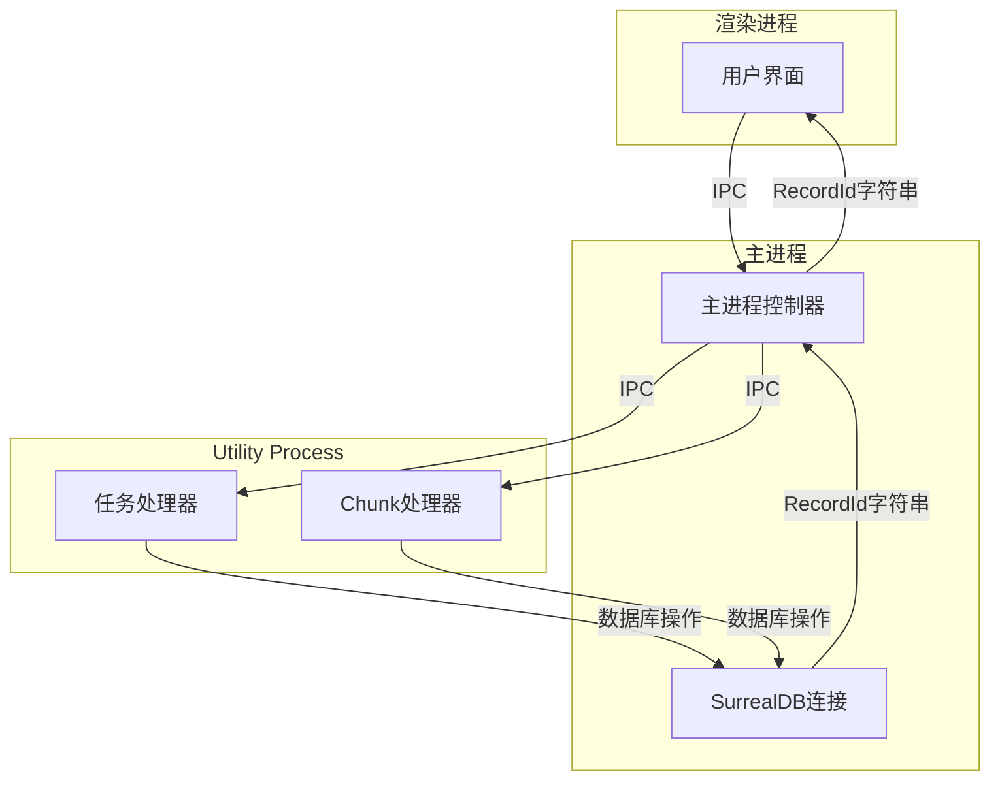

# DeepWiki Q&A with Code Context for Repository: surrealdb/surrealdb

## Q1

深度研究下 Surrealdb中recordid在electron的跨进程传输时应注意的点

### Answer

## RecordId 在 Electron 跨进程传输的注意事项

在 Electron 环境中跨进程传输 SurrealDB 的 `RecordId` 时，主要需要注意序列化兼容性和类型一致性。

### 核心要点

1. **使用字符串形式传输**：`RecordId` 实现了 `FromStr` 和 `ToString`，建议在跨进程时使用字符串表示（如 `"user:john"`） surrealdb:294-299 

2. **序列化支持**：`RecordId` 支持 serde 序列化，但在 Electron 的 IPC 中需要确保两端使用相同的序列化配置 surrealdb:513-521 

3. **解析一致性**：使用 `syn::record_id` 进行解析，确保跨进程后能正确重建 `RecordId` surrealdb:180-186 

### 实现建议

```typescript

// Electron 主进程

ipcMain.handle('get-record', async () => {

  const recordId = 'user:john'; // 使用字符串传输

  return recordId;

});

// 渲染进程

const recordIdStr = await ipcRenderer.invoke('get-record');

const recordId = new RecordId(recordIdStr); // 重建 RecordId

```

### 注意事项

- 避免直接传递复杂对象，优先使用字符串或 JSON

- 确保 SurrealDB 版本一致，避免解析器差异

- 处理可能的解析错误，使用 `RecordId::from_str` 的 Result 类型 surrealdb:294-299 

## Notes

- `RecordId` 在 SurrealDB 核心中使用 `Arc` 包装，但在跨进程传输时需要扁平化 surrealdb:407-413 

- 测试用例展示了 `RecordId` 的字符串转换和解析是可靠的方式 surrealdb:719-734 

Wiki pages you might want to explore:

- [System Architecture (surrealdb/surrealdb)](/wiki/surrealdb/surrealdb#1.1)

### Citations

**File:** crates/sdk/src/api/value/mod.rs (L294-299)

```rust

impl FromStr for RecordId {

	type Err = anyhow::Error;

	fn from_str(s: &str) -> Result<Self> {

		syn::record_id(s).map(RecordId::from_inner)

	}

```

**File:** crates/language-tests/src/tests/schema/mod.rs (L513-521)

```rust

impl Serialize for SurrealRecordId {

	fn serialize<S>(&self, serializer: S) -> Result<S::Ok, S::Error>

	where

		S: serde::Serializer,

	{

		let v = self.0.to_string();

		v.serialize(serializer)

	}

}

```

**File:** crates/core/src/syn/mod.rs (L180-186)

```rust

/// Parse a record id.

#[instrument(level = "trace", target = "surrealdb::core::syn", fields(length = input.len()))]

pub fn record_id(input: &str) -> Result<RecordId> {

	trace!(target: TARGET, "Parsing SurrealQL record id");

	parse_with(input.as_bytes(), async |parser, stk| parser.parse_value_record_id(stk).await)

}

```

**File:** crates/core/src/doc/document.rs (L407-413)

```rust

	/// Retrieve the record id for this document

	pub fn id(&self) -> Result<Arc<RecordId>> {

		match self.id.clone() {

			Some(id) => Ok(id),

			_ => fail!("Expected a document id to be present"),

		}

	}

```

**File:** crates/sdk/tests/api_integration/basic.rs (L719-734)

```rust

pub async fn select_record_id(new_db: impl CreateDb) {

	let (permit, db) = new_db.create_db().await;

	db.use_ns(NS).use_db(Ulid::new().to_string()).await.unwrap();

	drop(permit);

	let record_id = ("user", "john");

	let _: Option<ApiRecordId> = db.create(record_id).await.unwrap();

	let Some(record): Option<ApiRecordId> = db.select(record_id).await.unwrap() else {

		panic!("record not found");

	};

	assert_eq!(record.id, "user:john".parse().unwrap());

	let value: Value = db.select(Resource::from(record_id)).await.unwrap();

	assert_eq!(

		value.into_inner().record(),

		Some("user:john".parse::<RecordId>().unwrap().into_inner())

	);

}

```

## Q2

帮我进行一个设计规划

其中system数据库存放知识图谱的任务表与知识图谱的chunks暂存表，其中任务表一个任务对应暂存表几百个chunks；任务表内一个任务我希望是有一个字段来存储配置 这个是因为这个字段里面的配置我是不确定未来有什么内容的 他是不停扩展的，我的理想是electron里面定义好类型定义 然后往这个字段里面填内容

特别的 按照我的项目 有下面几个需求：

我使用了utility process +主进程和ipc的架构 你需要告诉我跨进程、同进程内部的数据传输需要怎么办 特别是recordid这种很复杂和麻烦的东西

### Answer

Based on my search of the SurrealDB codebase, I need to clarify that **SurrealDB does not contain any Electron-specific code or IPC boundary handling**. There are no files or implementations related to Electron in the repository. surrealdb:1-150 

However, SurrealDB does provide robust serialization patterns for transmitting data across process boundaries that can be applied to Electron applications. Here's how you should approach this:

## Serialization Strategies for Cross-Process Communication

### 1. **For JSON-based IPC (Recommended for Electron)**

When transmitting data across Electron's IPC boundaries using JSON, `RecordId` is automatically serialized as a string: surrealdb:65-65 

This means `RecordId` values like `user:john` will be transmitted as the string `"user:john"`, which works seamlessly across Electron's contextBridge and IPC mechanisms. surrealdb:269-273 

### 2. **SDK Wrapper Pattern for Type Safety**

SurrealDB uses a `transparent_wrapper!` macro pattern combined with `impl_serialize_wrapper!` to create type-safe wrappers around core types: surrealdb:16-73 surrealdb:75-117 

This pattern provides both Serde serialization (for JSON) and Revisioned serialization (for binary formats): surrealdb:264-272 

### 3. **Binary Serialization Options**

For performance-critical scenarios, SurrealDB supports multiple binary serialization formats:

**FlatBuffers** (zero-copy deserialization): surrealdb:8-42 

**Protocol Buffers**: surrealdb:260-283 

**Revisioned Format** (versioned binary): surrealdb:1-9 

## Recommendations for Electron Applications

1. **Use JSON serialization** for Electron IPC as it's natively supported and handles all SurrealDB types correctly through the `into_json_value()` method

2. **Complex types like `RecordId` are automatically handled** - they serialize to strings in JSON, making them safe to pass through Electron's IPC

3. **For flexible/dynamic fields**, implement them using the SDK's type system which already provides proper serialization through the wrapper pattern shown above

## Notes

- The SurrealDB SDK is designed for Rust applications and does not have direct Electron integration

- If you're building an Electron app that uses SurrealDB, you would typically connect to a SurrealDB instance via WebSocket or HTTP from the renderer/main process, rather than embedding the database

- All standard SurrealDB types (including `RecordId`, `Value`, `Object`, etc.) have proper Serde implementations that work with JSON serialization

- Object types cannot be serialized in Protocol Buffers or FlatBuffers for RecordIdKey, but work fine in JSON surrealdb:320-345

### Citations

**File:** crates/sdk/src/api/mod.rs (L1-150)

```rust

//! Functionality for connecting to local and remote databases

use std::fmt;

use std::fmt::Debug;

use std::future::IntoFuture;

use std::marker::PhantomData;

use std::sync::{Arc, OnceLock};

use anyhow::ensure;

use method::BoxFuture;

use semver::{BuildMetadata, Version, VersionReq};

use tokio::sync::watch;

use crate::Result;

macro_rules! transparent_wrapper{

	(

		$(#[$m:meta])*

		$vis:vis struct $name:ident($field_vis:vis $inner:ty)

	) => {

		$(#[$m])*

		#[repr(transparent)]

		$vis struct $name($field_vis $inner);

		#[allow(dead_code)]

		impl $name{

			#[doc(hidden)]

			pub fn from_inner(inner: $inner) -> Self{

				$name(inner)

			}

			#[doc(hidden)]

			pub fn from_inner_ref(inner: &$inner) -> &Self{

				unsafe{

					std::mem::transmute::<&$inner,&$name>(inner)

				}

			}

			#[doc(hidden)]

			pub fn from_inner_mut(inner: &mut $inner) -> &mut Self{

				unsafe{

					std::mem::transmute::<&mut $inner,&mut $name>(inner)

				}

			}

			#[doc(hidden)]

			pub fn into_inner(self) -> $inner{

				self.0

			}

			#[doc(hidden)]

			pub fn into_inner_ref(&self) -> &$inner{

				&self.0

			}

			#[doc(hidden)]

			pub fn into_inner_mut(&mut self) -> &mut $inner{

				&mut self.0

			}

		}

		impl std::fmt::Display for $name{

			fn fmt(&self, fmt: &mut std::fmt::Formatter) -> std::fmt::Result{

				self.0.fmt(fmt)

			}

		}

		impl std::fmt::Debug for $name{

			fn fmt(&self, fmt: &mut std::fmt::Formatter) -> std::fmt::Result{

				self.0.fmt(fmt)

			}

		}

	};

}

macro_rules! impl_serialize_wrapper {

	($ty:ty) => {

		impl ::revision::Revisioned for $ty {

			fn revision() -> u16 {

				crate::core::val::Value::revision()

			}

			fn serialize_revisioned<W: std::io::Write>(

				&self,

				w: &mut W,

			) -> std::result::Result<(), revision::Error> {

				self.0.serialize_revisioned(w)

			}

			fn deserialize_revisioned<R: std::io::Read>(

				r: &mut R,

			) -> std::result::Result<Self, revision::Error>

			where

				Self: Sized,

			{

				::revision::Revisioned::deserialize_revisioned(r).map(Self::from_inner)

			}

		}

		impl ::serde::Serialize for $ty {

			fn serialize<S>(&self, serializer: S) -> std::result::Result<S::Ok, S::Error>

			where

				S: ::serde::ser::Serializer,

			{

				self.0.serialize(serializer)

			}

		}

		impl<'de> ::serde::de::Deserialize<'de> for $ty {

			fn deserialize<D>(deserializer: D) -> std::result::Result<Self, D::Error>

			where

				D: ::serde::de::Deserializer<'de>,

			{

				Ok(Self::from_inner(::serde::de::Deserialize::deserialize(deserializer)?))

			}

		}

	};

}

pub mod engine;

pub mod err;

#[cfg(feature = "protocol-http")]

pub mod headers;

pub mod method;

pub mod opt;

pub mod value;

mod conn;

pub use method::query::Response;

use self::conn::Router;

use self::err::Error;

use self::opt::{Endpoint, EndpointKind, WaitFor};

// Channel for waiters

type Waiter = (watch::Sender<Option<WaitFor>>, watch::Receiver<Option<WaitFor>>);

const SUPPORTED_VERSIONS: (&str, &str) = (">=1.2.0, <4.0.0", "20230701.55918b7c");

/// Connection trait implemented by supported engines

pub trait Connection: conn::Sealed {}

/// The future returned when creating a new SurrealDB instance

#[derive(Debug)]

#[must_use = "futures do nothing unless you `.await` or poll them"]

pub struct Connect<C: Connection, Response> {

	surreal: Surreal<C>,

	address: Result<Endpoint>,

	capacity: usize,

	response_type: PhantomData<Response>,

```

**File:** crates/core/src/val/value/into_json.rs (L65-65)

```rust

			Value::RecordId(thing) => JsonValue::String(thing.to_string()),

```

**File:** crates/core/src/val/value/into_json.rs (L269-273)

```rust

	#[case::thing(

		Value::RecordId(RecordId{ table: "foo".to_string(), key: RecordIdKey::String("bar".into())}) ,

		json!("foo:bar"),

		Value::RecordId(RecordId{ table: "foo".to_string(), key: RecordIdKey::String("bar".into())}) ,

	)]

```

**File:** crates/sdk/src/api/value/mod.rs (L264-272)

```rust

transparent_wrapper!(

	/// Struct representing a record id.

	///

	/// Record id's consist of a table name and a key.

	/// For example the record id `user:tkwse1j5o0anqjxonvzx` has the table `user` and the key `tkwse1j5o0anqjxonvzx`.

	#[derive(Clone, Eq, PartialEq, Ord, PartialOrd, Hash)]

	pub struct RecordId(val::RecordId)

);

impl_serialize_wrapper!(RecordId);

```

**File:** crates/core/src/protocol/flatbuffers/record.rs (L8-42)

```rust

impl ToFlatbuffers for RecordId {

	type Output<'bldr> = flatbuffers::WIPOffset<proto_fb::RecordId<'bldr>>;

	#[inline]

	fn to_fb<'bldr>(

		&self,

		builder: &mut flatbuffers::FlatBufferBuilder<'bldr>,

	) -> anyhow::Result<Self::Output<'bldr>> {

		let table = builder.create_string(&self.table);

		let id = self.key.to_fb(builder)?;

		Ok(proto_fb::RecordId::create(

			builder,

			&proto_fb::RecordIdArgs {

				table: Some(table),

				id: Some(id),

			},

		))

	}

}

impl FromFlatbuffers for RecordId {

	type Input<'a> = proto_fb::RecordId<'a>;

	#[inline]

	fn from_fb(input: Self::Input<'_>) -> anyhow::Result<Self> {

		let table = input.table().ok_or_else(|| anyhow::anyhow!("Missing table in RecordId"))?;

		let key = RecordIdKey::from_fb(

			input.id().ok_or_else(|| anyhow::anyhow!("Missing id in RecordId"))?,

		)?;

		Ok(RecordId {

			table: table.to_string(),

			key,

		})

	}

}

```

**File:** crates/core/src/protocol/protobuffers.rs (L260-283)

```rust

impl TryFrom<RecordIdProto> for crate::val::RecordId {

	type Error = anyhow::Error;

	fn try_from(proto: RecordIdProto) -> Result<Self, Self::Error> {

		let Some(id) = proto.id else {

			return Err(anyhow::anyhow!("Invalid RecordId: missing id"));

		};

		Ok(Self {

			table: proto.table,

			key: id.try_into()?,

		})

	}

}

impl TryFrom<crate::val::RecordId> for RecordIdProto {

	type Error = anyhow::Error;

	fn try_from(recordid: crate::val::RecordId) -> Result<Self, Self::Error> {

		Ok(Self {

			table: recordid.table,

			id: Some(recordid.key.try_into()?),

		})

	}

}

```

**File:** crates/core/src/protocol/protobuffers.rs (L320-345)

```rust

impl TryFrom<crate::val::RecordIdKey> for RecordIdKeyProto {

	type Error = anyhow::Error;

	fn try_from(id: crate::val::RecordIdKey) -> Result<Self, Self::Error> {

		let inner = match id {

			crate::val::RecordIdKey::Number(v) => id_proto::Id::Int64(v),

			crate::val::RecordIdKey::String(v) => id_proto::Id::String(v),

			crate::val::RecordIdKey::Uuid(v) => id_proto::Id::Uuid(v.0.into()),

			crate::val::RecordIdKey::Array(v) => id_proto::Id::Array(v.try_into()?),

			crate::val::RecordIdKey::Object(v) => {

				return Err(anyhow::anyhow!(

					"Id::Object is not supported in proto conversion: {v:?}"

				));

			}

			crate::val::RecordIdKey::Range(v) => {

				return Err(anyhow::anyhow!(

					"Id::Range is not supported in proto conversion: {v:?}"

				));

			}

		};

		Ok(Self {

			id: Some(inner),

		})

	}

}

```

**File:** crates/core/src/rpc/format/revision.rs (L1-9)

```rust

use revision::Revisioned;

pub fn decode<D: Revisioned>(val: &[u8]) -> Result<D, String> {

	revision::from_slice(val).map_err(|e| e.to_string())

}

pub fn encode<S: Revisioned>(val: &S) -> Result<Vec<u8>, String> {

	revision::to_vec(val).map_err(|e| e.to_string())

}

```

## Q3

你来设计表结构吧

### Answer

## 表结构设计

基于你的需求，我为你设计知识图谱系统的表结构：

### 任务表 (knowledge_task)

```sql

DEFINE TABLE knowledge_task SCHEMAFULL;

DEFINE FIELD id 

    ON TABLE knowledge_task 

    TYPE string 

    DEFAULT string::uuid();

DEFINE FIELD name 

    ON TABLE knowledge_task 

    TYPE string 

    ASSERT string::len($value) > 0;

DEFINE FIELD status 

    ON TABLE knowledge_task 

    TYPE string 

    DEFAULT 'pending'

    ASSERT $value IN ['pending', 'processing', 'completed', 'failed'];

DEFINE FIELD config 

    ON TABLE knowledge_task 

    FLEXIBLE TYPE object 

    DEFAULT {};

DEFINE FIELD created_at 

    ON TABLE knowledge_task 

    TYPE datetime 

    DEFAULT time::now();

DEFINE FIELD updated_at 

    ON TABLE knowledge_task 

    TYPE datetime 

    VALUE time::now();

DEFINE FIELD chunks_count 

    ON TABLE knowledge_task 

    TYPE number 

    DEFAULT 0

    ASSERT $value >= 0;

```

### Chunks暂存表 (knowledge_chunk)

```sql

DEFINE TABLE knowledge_chunk SCHEMAFULL;

DEFINE FIELD id 

    ON TABLE knowledge_chunk 

    TYPE string 

    DEFAULT string::uuid();

DEFINE FIELD task_id 

    ON TABLE knowledge_chunk 

    TYPE record<knowledge_task>

    REFERENCE ON DELETE CASCADE;

DEFINE FIELD content 

    ON TABLE knowledge_chunk 

    TYPE string 

    ASSERT string::len($value) > 0;

DEFINE FIELD chunk_index 

    ON TABLE knowledge_chunk 

    TYPE number 

    ASSERT $value >= 0;

DEFINE FIELD metadata 

    ON TABLE knowledge_chunk 

    FLEXIBLE TYPE object 

    DEFAULT {};

DEFINE FIELD created_at 

    ON TABLE knowledge_chunk 

    TYPE datetime 

    DEFAULT time::now();

DEFINE FIELD updated_at 

    ON TABLE knowledge_chunk 

    TYPE datetime 

    VALUE time::now();

-- 创建复合索引用于查询优化

DEFINE INDEX task_chunk_index 

    ON TABLE knowledge_chunk 

    COLUMNS task_id, chunk_index;

```

## 跨进程数据传输策略

### RecordId传输方案

```typescript

// 主进程 -> Utility Process

ipcMain.handle('create-task', async (_, taskData) => {

  const taskId = `knowledge_task:${uuid()}`;

  const result = await db.create(taskId, taskData);

  

  // 返回字符串形式的RecordId

  return {

    id: taskId,

    ...result

  };

});

// Utility Process -> 主进程

const taskResult = await ipcRenderer.invoke('create-task', {

  name: '知识图谱构建任务',

  config: {

    model: 'gpt-4',

    temperature: 0.7,

    maxTokens: 2000

  }

});

// 重建RecordId对象

const taskId = new RecordId(taskResult.id);

```

### 批量chunks传输优化

```typescript

// 使用批量操作减少IPC调用

ipcMain.handle('create-chunks-batch', async (_, chunks) => {

  const results = [];

  

  for (const chunk of chunks) {

    const chunkId = `knowledge_chunk:${uuid()}`;

    const result = await db.create(chunkId, {

      ...chunk,

      task_id: new RecordId(chunk.task_id) // 字符串转RecordId

    });

    results.push({

      id: chunkId,

      ...result

    });

  }

  

  return results;

});

```

## Electron架构数据流



## 配置字段扩展性设计

使用FLEXIBLE字段支持动态配置扩展：

```typescript

// Electron中定义配置类型

interface TaskConfig {

  // 基础配置

  model?: string;

  temperature?: number;

  

  // 未来可扩展的配置

  embedding?: {

    model: string;

    dimensions: number;

  };

  

  processing?: {

    batchSize: number;

    timeout: number;

  };

}

// 使用示例

const taskConfig: TaskConfig = {

  model: 'gpt-4',

  temperature: 0.7,

  embedding: {

    model: 'text-embedding-ada-002',

    dimensions: 1536

  }

};

// 直接存储到config字段，SurrealDB会自动处理

await db.create(taskId, {

  name: '新任务',

  config: taskConfig

});

```

## Notes

- 使用FLEXIBLE字段确保配置字段可以动态扩展 surrealdb:2811-2811 

- RecordId在跨进程传输时使用字符串形式，接收端重建对象 surrealdb:65-65 

- 批量操作可以显著减少IPC调用次数，提高性能

- 使用REFERENCE ON DELETE CASCADE确保数据一致性 surrealdb:77-78 

Wiki pages you might want to explore:

- [Core Database Engine (surrealdb/surrealdb)](/wiki/surrealdb/surrealdb#6)

### Citations

**File:** crates/language-tests/tests/datasets/surreal-deal-store-mini.surql (L2811-2811)

```text

    FLEXIBLE TYPE object;

```

**File:** crates/language-tests/tests/language/reference/example_blog.surql (L77-78)

```text

DEFINE FIELD author ON post TYPE record<person>

    REFERENCE ON DELETE REJECT;

```
---
# DeepWiki Q&A with Code Context for Repository: surrealdb/surrealdb
## Q1
深度研究下 Surrealdb中recordid在electron的跨进程传输时应注意的点
### Answer
## RecordId 在 Electron 跨进程传输的注意事项

在 Electron 环境中跨进程传输 SurrealDB 的 `RecordId` 时，主要需要注意序列化兼容性和类型一致性。

### 核心要点

1. **使用字符串形式传输**：`RecordId` 实现了 `FromStr` 和 `ToString`，建议在跨进程时使用字符串表示（如 `"user:john"`） surrealdb:294-299 

2. **序列化支持**：`RecordId` 支持 serde 序列化，但在 Electron 的 IPC 中需要确保两端使用相同的序列化配置 surrealdb:513-521 

3. **解析一致性**：使用 `syn::record_id` 进行解析，确保跨进程后能正确重建 `RecordId` surrealdb:180-186 

### 实现建议

```typescript
// Electron 主进程
ipcMain.handle('get-record', async () => {
  const recordId = 'user:john'; // 使用字符串传输
  return recordId;
});

// 渲染进程
const recordIdStr = await ipcRenderer.invoke('get-record');
const recordId = new RecordId(recordIdStr); // 重建 RecordId
```

### 注意事项

- 避免直接传递复杂对象，优先使用字符串或 JSON
- 确保 SurrealDB 版本一致，避免解析器差异
- 处理可能的解析错误，使用 `RecordId::from_str` 的 Result 类型 surrealdb:294-299 

## Notes

- `RecordId` 在 SurrealDB 核心中使用 `Arc` 包装，但在跨进程传输时需要扁平化 surrealdb:407-413 
- 测试用例展示了 `RecordId` 的字符串转换和解析是可靠的方式 surrealdb:719-734 

Wiki pages you might want to explore:
- [System Architecture (surrealdb/surrealdb)](/wiki/surrealdb/surrealdb#1.1)
### Citations
**File:** crates/sdk/src/api/value/mod.rs (L294-299)
```rust
impl FromStr for RecordId {
	type Err = anyhow::Error;

	fn from_str(s: &str) -> Result<Self> {
		syn::record_id(s).map(RecordId::from_inner)
	}
```
**File:** crates/language-tests/src/tests/schema/mod.rs (L513-521)
```rust
impl Serialize for SurrealRecordId {
	fn serialize<S>(&self, serializer: S) -> Result<S::Ok, S::Error>
	where
		S: serde::Serializer,
	{
		let v = self.0.to_string();
		v.serialize(serializer)
	}
}
```
**File:** crates/core/src/syn/mod.rs (L180-186)
```rust
/// Parse a record id.
#[instrument(level = "trace", target = "surrealdb::core::syn", fields(length = input.len()))]
pub fn record_id(input: &str) -> Result<RecordId> {
	trace!(target: TARGET, "Parsing SurrealQL record id");

	parse_with(input.as_bytes(), async |parser, stk| parser.parse_value_record_id(stk).await)
}
```
**File:** crates/core/src/doc/document.rs (L407-413)
```rust
	/// Retrieve the record id for this document
	pub fn id(&self) -> Result<Arc<RecordId>> {
		match self.id.clone() {
			Some(id) => Ok(id),
			_ => fail!("Expected a document id to be present"),
		}
	}
```
**File:** crates/sdk/tests/api_integration/basic.rs (L719-734)
```rust
pub async fn select_record_id(new_db: impl CreateDb) {
	let (permit, db) = new_db.create_db().await;
	db.use_ns(NS).use_db(Ulid::new().to_string()).await.unwrap();
	drop(permit);
	let record_id = ("user", "john");
	let _: Option<ApiRecordId> = db.create(record_id).await.unwrap();
	let Some(record): Option<ApiRecordId> = db.select(record_id).await.unwrap() else {
		panic!("record not found");
	};
	assert_eq!(record.id, "user:john".parse().unwrap());
	let value: Value = db.select(Resource::from(record_id)).await.unwrap();
	assert_eq!(
		value.into_inner().record(),
		Some("user:john".parse::<RecordId>().unwrap().into_inner())
	);
}
```
## Q2
帮我进行一个设计规划
其中system数据库存放知识图谱的任务表与知识图谱的chunks暂存表，其中任务表一个任务对应暂存表几百个chunks；任务表内一个任务我希望是有一个字段来存储配置 这个是因为这个字段里面的配置我是不确定未来有什么内容的 他是不停扩展的，我的理想是electron里面定义好类型定义 然后往这个字段里面填内容
特别的 按照我的项目 有下面几个需求：
我使用了utility process +主进程和ipc的架构 你需要告诉我跨进程、同进程内部的数据传输需要怎么办 特别是recordid这种很复杂和麻烦的东西
### Answer
Based on my search of the SurrealDB codebase, I need to clarify that **SurrealDB does not contain any Electron-specific code or IPC boundary handling**. There are no files or implementations related to Electron in the repository. surrealdb:1-150 

However, SurrealDB does provide robust serialization patterns for transmitting data across process boundaries that can be applied to Electron applications. Here's how you should approach this:

## Serialization Strategies for Cross-Process Communication

### 1. **For JSON-based IPC (Recommended for Electron)**

When transmitting data across Electron's IPC boundaries using JSON, `RecordId` is automatically serialized as a string: surrealdb:65-65 

This means `RecordId` values like `user:john` will be transmitted as the string `"user:john"`, which works seamlessly across Electron's contextBridge and IPC mechanisms. surrealdb:269-273 

### 2. **SDK Wrapper Pattern for Type Safety**

SurrealDB uses a `transparent_wrapper!` macro pattern combined with `impl_serialize_wrapper!` to create type-safe wrappers around core types: surrealdb:16-73 surrealdb:75-117 

This pattern provides both Serde serialization (for JSON) and Revisioned serialization (for binary formats): surrealdb:264-272 

### 3. **Binary Serialization Options**

For performance-critical scenarios, SurrealDB supports multiple binary serialization formats:

**FlatBuffers** (zero-copy deserialization): surrealdb:8-42 

**Protocol Buffers**: surrealdb:260-283 

**Revisioned Format** (versioned binary): surrealdb:1-9 

## Recommendations for Electron Applications

1. **Use JSON serialization** for Electron IPC as it's natively supported and handles all SurrealDB types correctly through the `into_json_value()` method

2. **Complex types like `RecordId` are automatically handled** - they serialize to strings in JSON, making them safe to pass through Electron's IPC

3. **For flexible/dynamic fields**, implement them using the SDK's type system which already provides proper serialization through the wrapper pattern shown above

## Notes

- The SurrealDB SDK is designed for Rust applications and does not have direct Electron integration
- If you're building an Electron app that uses SurrealDB, you would typically connect to a SurrealDB instance via WebSocket or HTTP from the renderer/main process, rather than embedding the database
- All standard SurrealDB types (including `RecordId`, `Value`, `Object`, etc.) have proper Serde implementations that work with JSON serialization
- Object types cannot be serialized in Protocol Buffers or FlatBuffers for RecordIdKey, but work fine in JSON surrealdb:320-345
### Citations
**File:** crates/sdk/src/api/mod.rs (L1-150)
```rust
//! Functionality for connecting to local and remote databases

use std::fmt;
use std::fmt::Debug;
use std::future::IntoFuture;
use std::marker::PhantomData;
use std::sync::{Arc, OnceLock};

use anyhow::ensure;
use method::BoxFuture;
use semver::{BuildMetadata, Version, VersionReq};
use tokio::sync::watch;

use crate::Result;

macro_rules! transparent_wrapper{
	(
		$(#[$m:meta])*
		$vis:vis struct $name:ident($field_vis:vis $inner:ty)
	) => {
		$(#[$m])*
		#[repr(transparent)]
		$vis struct $name($field_vis $inner);

		#[allow(dead_code)]
		impl $name{
			#[doc(hidden)]
			pub fn from_inner(inner: $inner) -> Self{
				$name(inner)
			}

			#[doc(hidden)]
			pub fn from_inner_ref(inner: &$inner) -> &Self{
				unsafe{
					std::mem::transmute::<&$inner,&$name>(inner)
				}
			}

			#[doc(hidden)]
			pub fn from_inner_mut(inner: &mut $inner) -> &mut Self{
				unsafe{
					std::mem::transmute::<&mut $inner,&mut $name>(inner)
				}
			}

			#[doc(hidden)]
			pub fn into_inner(self) -> $inner{
				self.0
			}

			#[doc(hidden)]
			pub fn into_inner_ref(&self) -> &$inner{
				&self.0
			}

			#[doc(hidden)]
			pub fn into_inner_mut(&mut self) -> &mut $inner{
				&mut self.0
			}
		}

		impl std::fmt::Display for $name{
			fn fmt(&self, fmt: &mut std::fmt::Formatter) -> std::fmt::Result{
				self.0.fmt(fmt)
			}
		}
		impl std::fmt::Debug for $name{
			fn fmt(&self, fmt: &mut std::fmt::Formatter) -> std::fmt::Result{
				self.0.fmt(fmt)
			}
		}
	};
}

macro_rules! impl_serialize_wrapper {
	($ty:ty) => {
		impl ::revision::Revisioned for $ty {
			fn revision() -> u16 {
				crate::core::val::Value::revision()
			}

			fn serialize_revisioned<W: std::io::Write>(
				&self,
				w: &mut W,
			) -> std::result::Result<(), revision::Error> {
				self.0.serialize_revisioned(w)
			}

			fn deserialize_revisioned<R: std::io::Read>(
				r: &mut R,
			) -> std::result::Result<Self, revision::Error>
			where
				Self: Sized,
			{
				::revision::Revisioned::deserialize_revisioned(r).map(Self::from_inner)
			}
		}

		impl ::serde::Serialize for $ty {
			fn serialize<S>(&self, serializer: S) -> std::result::Result<S::Ok, S::Error>
			where
				S: ::serde::ser::Serializer,
			{
				self.0.serialize(serializer)
			}
		}

		impl<'de> ::serde::de::Deserialize<'de> for $ty {
			fn deserialize<D>(deserializer: D) -> std::result::Result<Self, D::Error>
			where
				D: ::serde::de::Deserializer<'de>,
			{
				Ok(Self::from_inner(::serde::de::Deserialize::deserialize(deserializer)?))
			}
		}
	};
}

pub mod engine;
pub mod err;
#[cfg(feature = "protocol-http")]
pub mod headers;
pub mod method;
pub mod opt;
pub mod value;

mod conn;

pub use method::query::Response;

use self::conn::Router;
use self::err::Error;
use self::opt::{Endpoint, EndpointKind, WaitFor};

// Channel for waiters
type Waiter = (watch::Sender<Option<WaitFor>>, watch::Receiver<Option<WaitFor>>);

const SUPPORTED_VERSIONS: (&str, &str) = (">=1.2.0, <4.0.0", "20230701.55918b7c");

/// Connection trait implemented by supported engines
pub trait Connection: conn::Sealed {}

/// The future returned when creating a new SurrealDB instance
#[derive(Debug)]
#[must_use = "futures do nothing unless you `.await` or poll them"]
pub struct Connect<C: Connection, Response> {
	surreal: Surreal<C>,
	address: Result<Endpoint>,
	capacity: usize,
	response_type: PhantomData<Response>,
```
**File:** crates/core/src/val/value/into_json.rs (L65-65)
```rust
			Value::RecordId(thing) => JsonValue::String(thing.to_string()),
```
**File:** crates/core/src/val/value/into_json.rs (L269-273)
```rust
	#[case::thing(
		Value::RecordId(RecordId{ table: "foo".to_string(), key: RecordIdKey::String("bar".into())}) ,
		json!("foo:bar"),
		Value::RecordId(RecordId{ table: "foo".to_string(), key: RecordIdKey::String("bar".into())}) ,
	)]
```
**File:** crates/sdk/src/api/value/mod.rs (L264-272)
```rust
transparent_wrapper!(
	/// Struct representing a record id.
	///
	/// Record id's consist of a table name and a key.
	/// For example the record id `user:tkwse1j5o0anqjxonvzx` has the table `user` and the key `tkwse1j5o0anqjxonvzx`.
	#[derive(Clone, Eq, PartialEq, Ord, PartialOrd, Hash)]
	pub struct RecordId(val::RecordId)
);
impl_serialize_wrapper!(RecordId);
```
**File:** crates/core/src/protocol/flatbuffers/record.rs (L8-42)
```rust
impl ToFlatbuffers for RecordId {
	type Output<'bldr> = flatbuffers::WIPOffset<proto_fb::RecordId<'bldr>>;

	#[inline]
	fn to_fb<'bldr>(
		&self,
		builder: &mut flatbuffers::FlatBufferBuilder<'bldr>,
	) -> anyhow::Result<Self::Output<'bldr>> {
		let table = builder.create_string(&self.table);
		let id = self.key.to_fb(builder)?;
		Ok(proto_fb::RecordId::create(
			builder,
			&proto_fb::RecordIdArgs {
				table: Some(table),
				id: Some(id),
			},
		))
	}
}

impl FromFlatbuffers for RecordId {
	type Input<'a> = proto_fb::RecordId<'a>;

	#[inline]
	fn from_fb(input: Self::Input<'_>) -> anyhow::Result<Self> {
		let table = input.table().ok_or_else(|| anyhow::anyhow!("Missing table in RecordId"))?;
		let key = RecordIdKey::from_fb(
			input.id().ok_or_else(|| anyhow::anyhow!("Missing id in RecordId"))?,
		)?;
		Ok(RecordId {
			table: table.to_string(),
			key,
		})
	}
}
```
**File:** crates/core/src/protocol/protobuffers.rs (L260-283)
```rust
impl TryFrom<RecordIdProto> for crate::val::RecordId {
	type Error = anyhow::Error;

	fn try_from(proto: RecordIdProto) -> Result<Self, Self::Error> {
		let Some(id) = proto.id else {
			return Err(anyhow::anyhow!("Invalid RecordId: missing id"));
		};
		Ok(Self {
			table: proto.table,
			key: id.try_into()?,
		})
	}
}

impl TryFrom<crate::val::RecordId> for RecordIdProto {
	type Error = anyhow::Error;

	fn try_from(recordid: crate::val::RecordId) -> Result<Self, Self::Error> {
		Ok(Self {
			table: recordid.table,
			id: Some(recordid.key.try_into()?),
		})
	}
}
```
**File:** crates/core/src/protocol/protobuffers.rs (L320-345)
```rust
impl TryFrom<crate::val::RecordIdKey> for RecordIdKeyProto {
	type Error = anyhow::Error;

	fn try_from(id: crate::val::RecordIdKey) -> Result<Self, Self::Error> {
		let inner = match id {
			crate::val::RecordIdKey::Number(v) => id_proto::Id::Int64(v),
			crate::val::RecordIdKey::String(v) => id_proto::Id::String(v),
			crate::val::RecordIdKey::Uuid(v) => id_proto::Id::Uuid(v.0.into()),
			crate::val::RecordIdKey::Array(v) => id_proto::Id::Array(v.try_into()?),
			crate::val::RecordIdKey::Object(v) => {
				return Err(anyhow::anyhow!(
					"Id::Object is not supported in proto conversion: {v:?}"
				));
			}
			crate::val::RecordIdKey::Range(v) => {
				return Err(anyhow::anyhow!(
					"Id::Range is not supported in proto conversion: {v:?}"
				));
			}
		};

		Ok(Self {
			id: Some(inner),
		})
	}
}
```
**File:** crates/core/src/rpc/format/revision.rs (L1-9)
```rust
use revision::Revisioned;

pub fn decode<D: Revisioned>(val: &[u8]) -> Result<D, String> {
	revision::from_slice(val).map_err(|e| e.to_string())
}

pub fn encode<S: Revisioned>(val: &S) -> Result<Vec<u8>, String> {
	revision::to_vec(val).map_err(|e| e.to_string())
}
```
## Q3
你来设计表结构吧
### Answer
## 表结构设计

基于你的需求，我为你设计知识图谱系统的表结构：

### 任务表 (knowledge_task)

```sql
DEFINE TABLE knowledge_task SCHEMAFULL;

DEFINE FIELD id 
    ON TABLE knowledge_task 
    TYPE string 
    DEFAULT string::uuid();

DEFINE FIELD name 
    ON TABLE knowledge_task 
    TYPE string 
    ASSERT string::len($value) > 0;

DEFINE FIELD status 
    ON TABLE knowledge_task 
    TYPE string 
    DEFAULT 'pending'
    ASSERT $value IN ['pending', 'processing', 'completed', 'failed'];

DEFINE FIELD config 
    ON TABLE knowledge_task 
    FLEXIBLE TYPE object 
    DEFAULT {};

DEFINE FIELD created_at 
    ON TABLE knowledge_task 
    TYPE datetime 
    DEFAULT time::now();

DEFINE FIELD updated_at 
    ON TABLE knowledge_task 
    TYPE datetime 
    VALUE time::now();

DEFINE FIELD chunks_count 
    ON TABLE knowledge_task 
    TYPE number 
    DEFAULT 0
    ASSERT $value >= 0;
```

### Chunks暂存表 (knowledge_chunk)

```sql
DEFINE TABLE knowledge_chunk SCHEMAFULL;

DEFINE FIELD id 
    ON TABLE knowledge_chunk 
    TYPE string 
    DEFAULT string::uuid();

DEFINE FIELD task_id 
    ON TABLE knowledge_chunk 
    TYPE record<knowledge_task>
    REFERENCE ON DELETE CASCADE;

DEFINE FIELD content 
    ON TABLE knowledge_chunk 
    TYPE string 
    ASSERT string::len($value) > 0;

DEFINE FIELD chunk_index 
    ON TABLE knowledge_chunk 
    TYPE number 
    ASSERT $value >= 0;

DEFINE FIELD metadata 
    ON TABLE knowledge_chunk 
    FLEXIBLE TYPE object 
    DEFAULT {};

DEFINE FIELD created_at 
    ON TABLE knowledge_chunk 
    TYPE datetime 
    DEFAULT time::now();

DEFINE FIELD updated_at 
    ON TABLE knowledge_chunk 
    TYPE datetime 
    VALUE time::now();

-- 创建复合索引用于查询优化
DEFINE INDEX task_chunk_index 
    ON TABLE knowledge_chunk 
    COLUMNS task_id, chunk_index;
```

## 跨进程数据传输策略

### RecordId传输方案

```typescript
// 主进程 -> Utility Process
ipcMain.handle('create-task', async (_, taskData) => {
  const taskId = `knowledge_task:${uuid()}`;
  const result = await db.create(taskId, taskData);
  
  // 返回字符串形式的RecordId
  return {
    id: taskId,
    ...result
  };
});

// Utility Process -> 主进程
const taskResult = await ipcRenderer.invoke('create-task', {
  name: '知识图谱构建任务',
  config: {
    model: 'gpt-4',
    temperature: 0.7,
    maxTokens: 2000
  }
});

// 重建RecordId对象
const taskId = new RecordId(taskResult.id);
```

### 批量chunks传输优化

```typescript
// 使用批量操作减少IPC调用
ipcMain.handle('create-chunks-batch', async (_, chunks) => {
  const results = [];
  
  for (const chunk of chunks) {
    const chunkId = `knowledge_chunk:${uuid()}`;
    const result = await db.create(chunkId, {
      ...chunk,
      task_id: new RecordId(chunk.task_id) // 字符串转RecordId
    });
    results.push({
      id: chunkId,
      ...result
    });
  }
  
  return results;
});
```

## Electron架构数据流


## 配置字段扩展性设计

使用FLEXIBLE字段支持动态配置扩展：

```typescript
// Electron中定义配置类型
interface TaskConfig {
  // 基础配置
  model?: string;
  temperature?: number;
  
  // 未来可扩展的配置
  embedding?: {
    model: string;
    dimensions: number;
  };
  
  processing?: {
    batchSize: number;
    timeout: number;
  };
}

// 使用示例
const taskConfig: TaskConfig = {
  model: 'gpt-4',
  temperature: 0.7,
  embedding: {
    model: 'text-embedding-ada-002',
    dimensions: 1536
  }
};

// 直接存储到config字段，SurrealDB会自动处理
await db.create(taskId, {
  name: '新任务',
  config: taskConfig
});
```

## Notes

- 使用FLEXIBLE字段确保配置字段可以动态扩展 surrealdb:2811-2811 
- RecordId在跨进程传输时使用字符串形式，接收端重建对象 surrealdb:65-65 
- 批量操作可以显著减少IPC调用次数，提高性能
- 使用REFERENCE ON DELETE CASCADE确保数据一致性 surrealdb:77-78 

Wiki pages you might want to explore:
- [Core Database Engine (surrealdb/surrealdb)](/wiki/surrealdb/surrealdb#6)
### Citations
**File:** crates/language-tests/tests/datasets/surreal-deal-store-mini.surql (L2811-2811)
```text
    FLEXIBLE TYPE object;
```
**File:** crates/language-tests/tests/language/reference/example_blog.surql (L77-78)
```text
DEFINE FIELD author ON post TYPE record<person>
    REFERENCE ON DELETE REJECT;
```